# Chat with Claude Opus 5 Max about the AI UNLEASHES CHAOS Circuit and PCB

Lorenz Attractor Circuit by Paul Horowitz in KiCAD

Every prompt is verbatim; every response is what Claude wrote at the time.
Each response opens with the board and schematic **as they stood when that
response was written**, pulled back out of the git history -- because what
the next prompt asks for only makes sense against what was on the screen
when it was typed.  The board as it stands now is in [README.md](README.md).

## Prompt 1

In graduate school I worked with Paul Horowitz, of [Art of Electronics](https://artofelectronics.net/) fame. I even contributed a few bits and pieces to the 3rd edition. (I am thanked in the footnotes, one of which simply says, "Jason, again.) I want you to build a nice little present for Paul, which could also live on as an open source project and a kit that people could build.

Make a KiCAD 10 project, schematic, and PCB to implement [Paul's Lorenz Attractor Circuit](https://seti.harvard.edu/unusual_stuff/misc/lorenz.htm).
* It should take power in through a simple USB-C connector. This means that you'll either need to make a negative voltage or change the circuit to power the op amps from only +5V. 
* You may need to make other changes to the circuit. Do it in a way that maintains is simple elegance and educational value.
* Its outputs ()"x", "-y", and "z") should each come out on a BNC connector.
* It would be good to be able to switch the capacitor "C" to the three different values shown: "slow!", "nice!", and "fast!". However, if this explodes the complexity, just pick "nice!".
* Feel free to use modern components if necessary, but try to keep packages as large as is reasonable. SMT is ok, but I want people to be able to hand solder and rework as much as possible (0805 R's and C's, for example).  I want you to take it all the way to gerbers, a BOM, and a CPL file that I can simply upload to a place like JLCPCB, NextPCB Rev 0, or CircuitHub.
* Select components that these places have plenty of in stock, such that that I can order in only one step. I do not want to consign any parts. I do not want to wait for out of stock items.
* Make 2-layer and also a 4-layer version. Do all of the placement and routing yourself.
* You should have a shell script or python file that just "makes" everything on the command line: the schematic, PCB, manufacturing files, and a document with a cost estimate and other manufacturing instructions for me. Your scripts should run as many checks as necessary to ensure that I can just upload the files, "click go", and have working boards show up at Paul's house.
* Make the design rule checks at least as strict as the cheap option's design rules at JLCPCB, NextPCB Rev 0, and CircuitHub.
* Lay out the schematic and the PCB as Paul does in his hand-drawn schematic. The schematic should be a single page. The PCB should fit within the fab and assembly house's discounted small size, but otherwise should be legible and logically arranged.
* The schematic should be in the beautiful "Art of Electronics style" --- the circuit is drawn, and things are labeled in such a way as to immediately answer typical questions that might arise in a reader's mind:
 - I don't want to see labels that disappear and magically reappear elsewhere (except maybe power and ground).
 - If a note belongs with a node or IC, write it right next to the node, not somewhere off to the side.
 - No labels should overlap components or other labels. You can spread things out a bit on the page to allow this to happen, but keep everything within the borders of the page. Really check that this is the case.
* The PCB's silkscreen should make it clear what the inputs and outputs are. 
 - Nothing on the silkscreen should overlap other silkscreen or components. Really check this. Make it beautiful.
 - The silkscreen should have the following on it: "AI Unleashes Chaos", "Circuit by Paul Horowitz", "PCB by Jason Gallicchio and Claude", today's date, and "rev A" in case we need to re-spin.
 - Component values and IC names should also be on the silkscreen (in addition to the reference designators) for educational purposes.
 - Write the equations and "suggested parameters" on the silkscreen. Check that the circuit actually implements them.
 - Include a little drawing of the "owl's face" on the PCB like Paul does in his schematic.
* Do a self-critical design review of the circuit, the way the schematic is drawn, the way the PCB is laid out, and the component and manufacturing selections. Make any changes. Iterate until satisfied.
* I will open the schematic and PCB in KiCAD and give you feedback after you've worked on it for many hours.

Record your response below in this document. Do this regularly, and check things into git as you go.

## Response 1

*The board and schematic as they stood when this was written — four layers, three rail lamps, and the owl on the back.  The schematic links to its PDF.*

| front | | back |
|---|---|---|
| 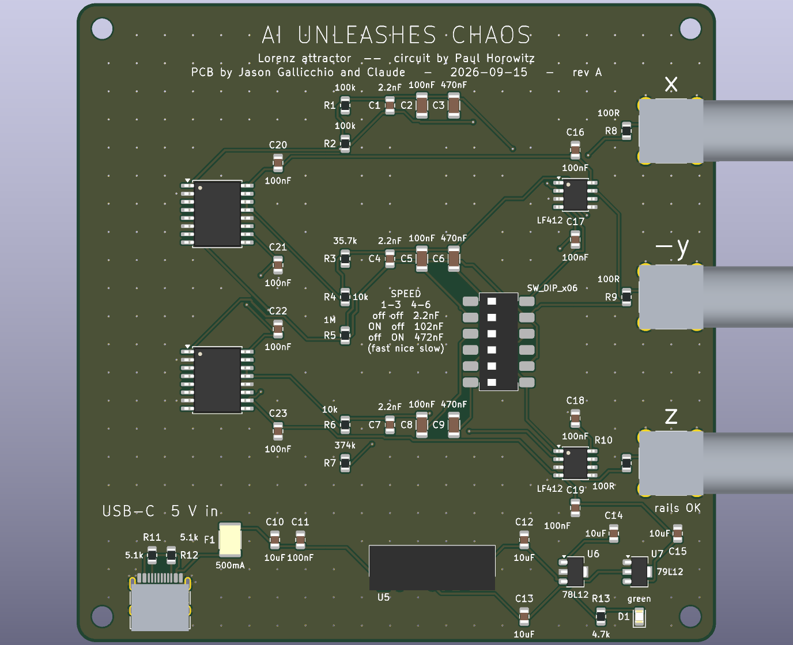 | 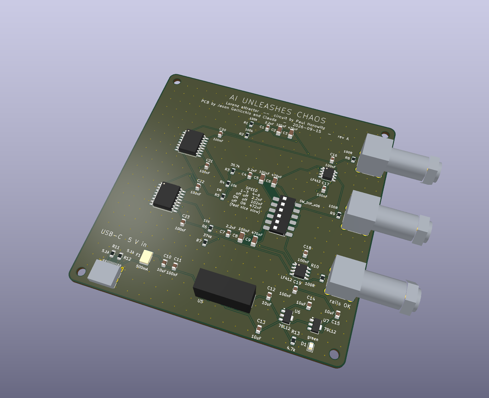 | 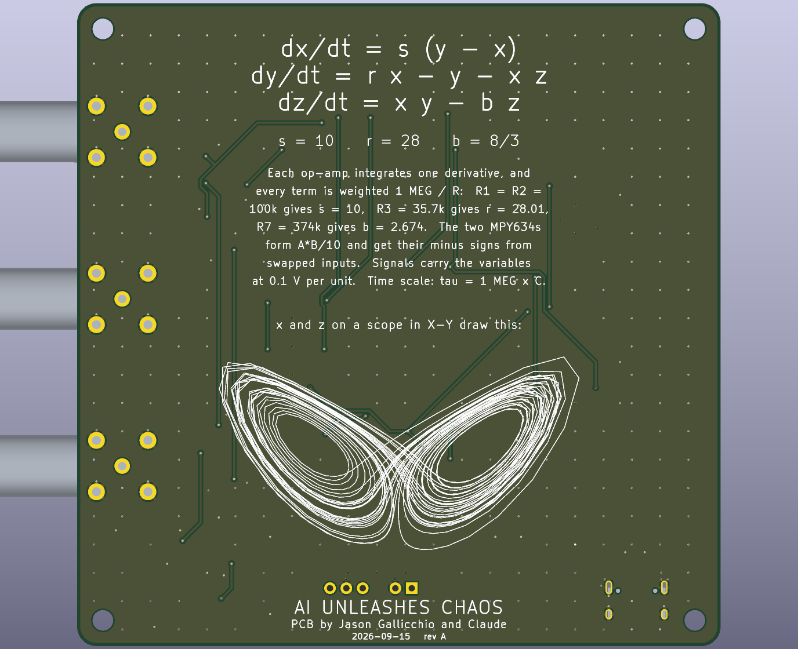 |

[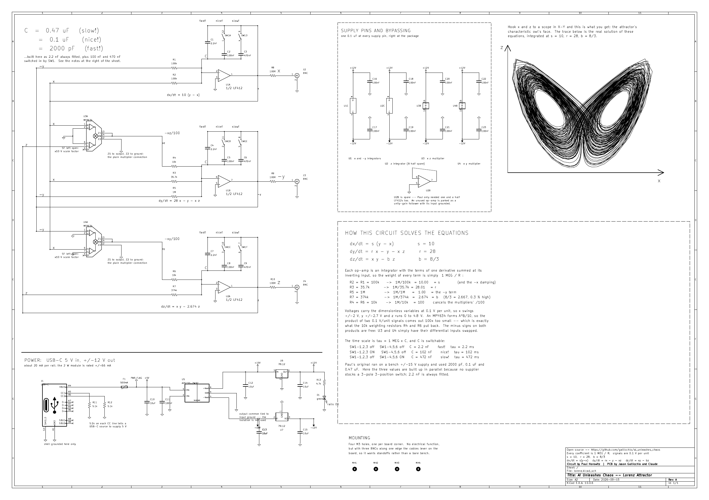](docs/history/response-1/schematic.pdf)

*(This section is the reply as it was written. Response 2 below changed some of
it — most visibly, there is no longer a four-layer board.)*

Built. `./make.py` regenerates everything from scratch in about 40 seconds and
refuses to finish unless every check passes. Current state:

| check | result |
|---|---|
| ERC | 0 violations |
| DRC + schematic parity, 2-layer | 0 violations |
| DRC + schematic parity, 4-layer | 0 violations |
| circuit checker (reads the netlist, not the drawing) | 75 checks pass |
| schematic layout (205 text items) | no overlaps, nothing outside the frame |
| fab package | all checks pass |

Open `hardware/lorenz.kicad_pro`. The 4-layer variant is `lorenz-4layer.kicad_pro`
and shares the schematic.

### What it is

Your circuit, unchanged: three lossy integrators built from **LF412s** and two
**MPY634s**, with the resistor values exactly as you drew them — 100k, 100k,
35.7k, 10k, 1M, 10k, 374k. The sign inversions still come free from swapping the
multipliers' differential inputs. `scripts/check_circuit.py` walks the exported
netlist, works out what each integrator actually computes from the resistors
really attached to it, and recovers **s = 10, r = 28.01, b = 2.6738** — 8/3 plus
0.27%, which is the 374k. It also checks the virtual earths, the multiplier
hookup, the matched capacitors, the outputs and every supply pin.

Both of your parts are still stocked at JLCPCB: LF412CDR (1037) and MPY634KU
(874). Being able to keep them is why the schematic looks like yours.

### The three things that had to change

**USB-C power.** 5 V in → `A0515S-2WR2` isolated module → ±15 V → 78L12/79L12 →
**±12 V**. The module alone is unregulated and climbs toward ±17 V at this
board's light load, which is too close to the MPY634's ±18 V absolute maximum
to trust across vendors; the regulators pin the rails and strip the converter's
100 kHz ripple. MPY634 is specified from ±8 V, and the largest signal on the
board is z at 4.8 V, so ±12 V is not tight.

**Speed switching.** No supplier stocks a 3-pole 3-position switch, and the three
integrators have to change together. So 2.2 nF C0G is always fitted and a 6-way
DIP switch adds 100 nF (poles 1–3) or 470 nF (poles 4–6) to all three at once:
2.2 nF fast, 102 nF nice, 472 nF slow. The table is on the silkscreen next to
the switch. This is the part of the design I like least — see the review.

**100 Ω in series with each BNC.** A JFET-input op-amp driving a metre of RG-58
will ring. They sit outside the summing network, so the equations are untouched,
and the error into a 1 MΩ scope input is 0.01%.

### What to look at when you open it

- **Schematic** (A2, one page): three integrator rows the way you stack them,
  multipliers on the left, your `C = 0.47 µF (slow!)…` note in the top-left
  corner, and the owl's face top-right — that trace is the real solution,
  integrated by `scripts/lorenz_curve.py`, not clip art. Supply pins and
  bypassing are grouped in their own dashed box, which is the job your "IC
  Pinouts (DIP)" box was doing.
- **PCB**: 100 × 100 mm, inside the discounted size everywhere. Front silkscreen
  is legends, port labels and the speed table; **turn it over** — the back
  carries the equations, your suggested parameters and a large owl.
- **`docs/DESIGN_REVIEW.md`** — what I think is wrong with it, including four
  router bugs the checks caught that each produce a board that *looks* right.
- **`docs/MANUFACTURING.md`** — what to upload, what to select, what it costs.

### Cost

Parts are **$71.69/board**, of which $61.17 is the pair of MPY634s. Two boards
fully assembled, two layers, including through-hole assembly and DHL: about
**$231**, so roughly $115 each. Five is about $74 each. Four layers adds $23 to
the order. `docs/MANUFACTURING.md` breaks it down and is regenerated from the
same parts table the BOM comes from, so it cannot drift.
*(Response 2 added twenty more components — three rail lamps, the chaos lamp
and its drive, the barrier parts — for **$0.17** a board. The current number is
in `docs/MANUFACTURING.md`.)*

### Biggest risk

The BNC footprint is drawn from SAMZO's drawing, not from a connector in my
hand. `out/lorenz/lorenz-assembly-top.pdf` prints 1:1 — please check it against
a real BNC-KYWE before ordering. Everything else on the board is a stock KiCad
footprint or dimensioned from a datasheet I read.

### Pictures

`./make.py` now writes these into `docs/images/` every build, so they cannot
drift from the design.

The back carries the equations, your suggested parameters and the attractor
itself — the trace is the real solution, integrated by `scripts/lorenz_curve.py`:


(NOTE that these links point to the current revision, not what resulted 
only from Prompt 1, which is why I included those as images at the start of each response.)

* [The schematic](docs/images/schematic.png)
* [front silkscreen](docs/images/lorenz-silk-top.png)
* [back silkscreen](docs/images/lorenz-silk-bottom.png)
* [front copper](docs/images/lorenz-top.png)
* [back copper](docs/images/lorenz-bottom.png)

*(Response 1 also built a four-layer board and pictured its two inner planes.
Response 2 dropped it — see below for the measurement that decided it.)*

Every one of these is byte-reproducible except `lorenz-render-iso.png`: KiCad's
renderer jitters a rotated camera, so that one image differs slightly from build
to build even though the board has not changed. Everything a fab reads —
gerbers, drill files, BOM, CPL — is reproducible, with timestamps pinned to the
board date.

Each board also gets a `.step` model (not tracked; it churns) and a
`-stats.txt` in its `out/` folder,
and PDFs of the schematic and both assembly drawings — the top one prints 1:1
for checking footprints against real parts.

### Answering `next_prompt.md`

**Do the schematics differ between 2-layer and 4-layer? Why are there two?**

They do not differ — `lorenz-4layer.kicad_sch` is a byte-for-byte copy that
`make.py` writes from `lorenz.kicad_sch` on every build, so the two cannot
drift apart. It is purely a KiCad requirement: a project is one `.kicad_pro`,
one `.kicad_sch` and one `.kicad_pcb` sharing a basename, and
`kicad-cli pcb drc --schematic-parity` finds the schematic by that basename. No
basename, no parity check — and the parity check is what guarantees the board
you send to the fab really is the circuit that was verified. I kept the copy
tracked rather than generated-only so that either project opens straight from a
clone without running anything first.

The only real differences between the two boards are the stackup and what is
poured on it: two layers puts ground on both sides, four puts signals outside,
a solid ground plane on In1 and a +12 V plane on In2. Same placement, same
schematic, same BOM, same pick-and-place.


## Prompt 2

Build process:

* On a different computer (my laptop), when I run make.py after setting `KICAD_APPRUN`, I get the following, which may indicate that not everything in this git repo is self contained. This should be reproducible by someone who just clones it off of github and types `./make.py`.
```
$ ./make.py 
KiCad 10.0.6

=== self-tests ======================================================
Cannot locate KiCad shared data (symbols/footprints).

BUILD FAILED: selftest_rotation.py failed
```
* Add a `make.py --clean` to remove everything that is generated by make.py. In addition to being good practice, this is useful so that people can know what is generated and what needs to live in git.


Schematics:

* I made a datasheets directory and download some datasheets there. You should make sure they are all downloaded: all parts and connectors and anything else that would be useful. I can get you any that you need. Do not check this into git for copyright reasons.
* Do the schematics differ at all between 2-layer and 4? If not, why are there two different schematics? Is this just a KiCAD requirement? When I have both the schematic and PCB open, I can't seem to click on one to highlight that spot in the other. Do they need to get linked in some way for that to work?
* Two web pages URLs along with QR codes for them should go on the back of the PCB:
 - <https://seti.harvard.edu/unusual_stuff/misc/lorenz.htm>
 - <https://github.com/gallicchio/ai_unleashes_chaos>
* The little table that explains the switch settings could be more clear
* You might have misinterpreted my request which came up in your "One label per signal net" section of your DESIGN_REVIEW.md document. I meant one human-readable comment-type label. The internal KiCAD labels can be whatever they need to be for the best error checking.
* There should be places to attach the ground clips of oscilloscope leads and marked (labeled) test points (places to probe) for all of the DC voltages and the other interesting places to probe in the circuit that you marked in the schematic, like "dx/dt = 10 (y - x)", "-xz/100", and "dy/dt = 28 x - y - x z".
* There should be at least 3 "rails OK" LEDs, one for USB and one for each of the regulated rails. They can be different colors so that one can know at a glance which one is not working. Or they could be all dim white LEDs if you do the following:
* Does it make sense to put LEDs on the x, -y, and z outputs? Or an RGB LED, where each color is driven by one of the outputs to make a chaotic color in "slow" mode? The advantage is that there would be something to look at even if you didn't plug in the BNCs to a scope. A resistor and LED would have a non-linear response, but I'm not sure if anything would be gained by making a proper proportional current drive, and I'm not sure how I'd deal with negative-going signals.
* I'm not familiar with the A0515S-2WR2. If it's truly isolated, as the schematic symbol suggests, would it be a good idea or a bad idea to keep the USB ground separate from what eventually becomes the oscilloscope ground to avoid ground loops? Or would that introduce more problems than it solves? You do acknowledge that "the isolation is not used," whose text you should keep on the schematic if you decide to continue not isolating it.

PCB:

* Does the 4-layer  board buy you anything useful here? Maybe with my pedagogical silkscreen requests, the board size is already going to be large and identical in size to the 2 layer. Is the 4-layer worth it? If it's not worth it, just drop it from the project.
* Should "rails OK" be right next to the LED? Does it really only light if both rails are, in fact, ok?
* The 3D model is missing some parts, especially the DIP switch and the A0515S device that makes +-15 V.
* The PCB should also include the text "Circuit by Paul Horowitz" and the web page, just like the schematic does, not only "PCB by Jason Gallicchio and Claude". Please, that's what he'll see first!
* The table that explains the switch settings could be more clear. At a minimum, the text should be rotated so that the words "off" and "ON" in each column should actually be under the 3 switches that they refer to. Make a silkscreen bar that is drawn coming perpendicular to the DIP switches, in between the columns. Doing this carefully should also solve my second problem with this, table, which is that the label "1-3" is above both columns of the off's and ON's, whereas "4-6" is above the capacitor values... and "fast", "nice", "slow" should be associated with rows of the table.
* The text "MountingHole" and its reference designator does not need to be on the silkscreen.
* The PCB layers in docs/images/ are mostly whitespace. Why aren't these images only as big as the PCB outline?


Misc:

* As part of the build process, generate PDFs and PNGs and 3D renders of the schematic and PCBs and include them here, as you've started to do.
* Continue calling this "rev A" until I actually pay to fabricate a board.
* As you are working, I might be updating next_prompt.md, but don't look at it until I put its content here and tell you to look at it.


## Response 2

*The board and schematic as they stood when this was written — two layers, the isolated ground split, the chaos lamp and the QR codes.  The schematic links to its PDF.*

| front | | back |
|---|---|---|
| 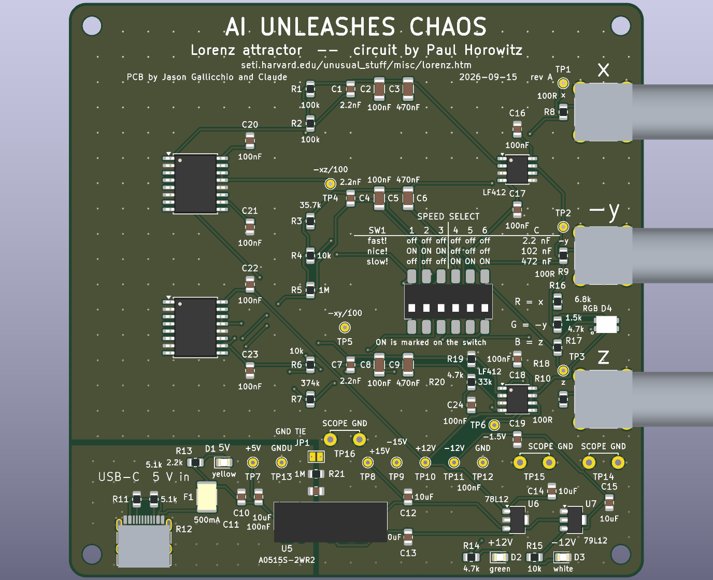 | 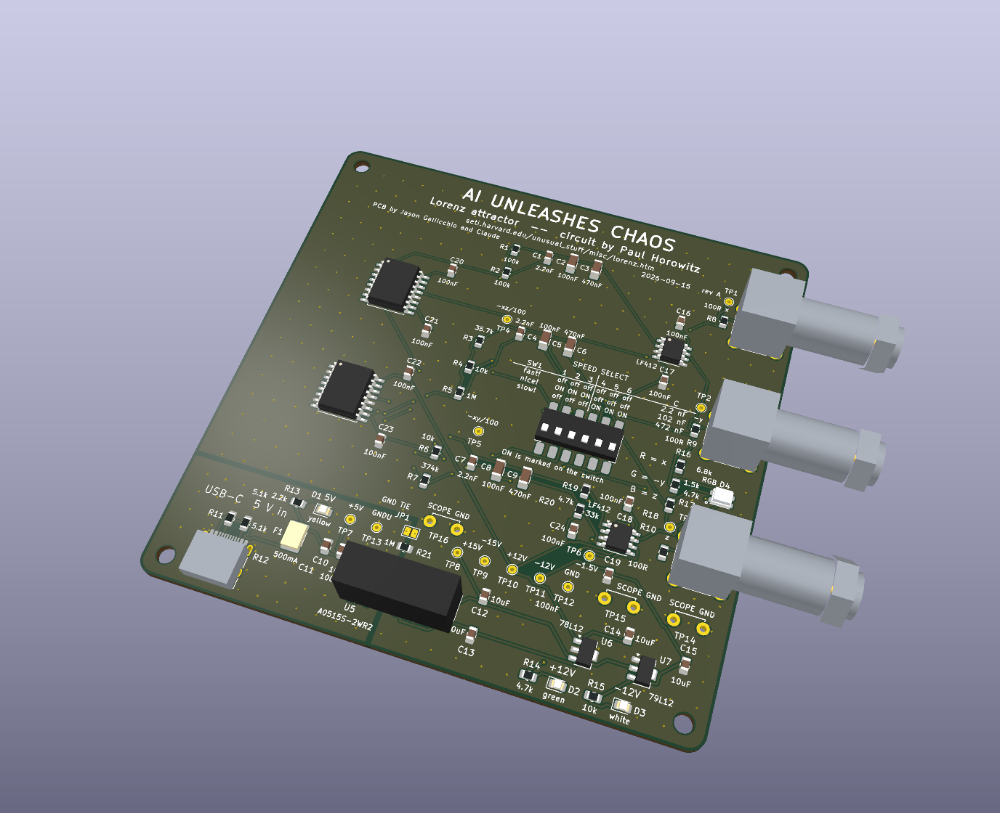 | 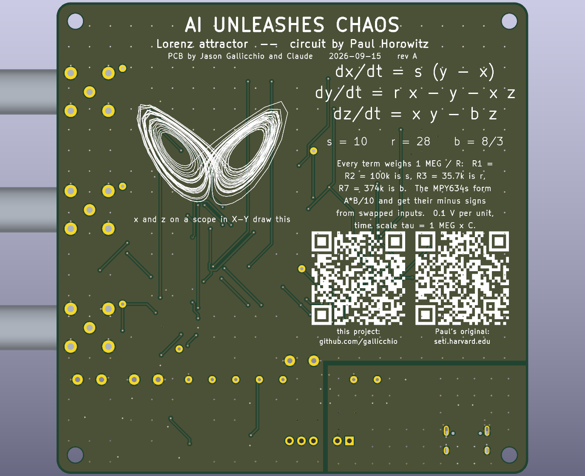 |

[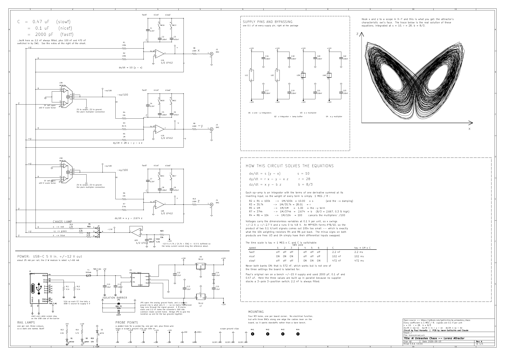](docs/history/response-2/schematic.pdf)

*(As written. Response 3 changed two things here: the three rail lamps are
gone, because the chaos lamp cannot light unless every rail is up, and the
lamp is now fed from each integrator's output node rather than from the return
lanes.)*

Everything below is built by `./make.py`, which now ends with **BUILD OK** only
if ERC, DRC with schematic parity, 116 circuit checks, the schematic layout
check, the fab-package checks and — new — a QR decoder all pass.

### The isolation: yes, use it

The A0515S-2WR2 really is isolated — 1 kV, no DC path — and the board was
throwing that away. It doesn't now. There are two grounds:

* **GND**, everything downstream of the converter: both op-amps, both
  multipliers, the BNC shells, the chaos lamp, every probe pad but one.
* **GNDU**, everything upstream: the USB-C connector *and its shell*, the CC
  pull-downs, the input bulk capacitors, the +5 V lamp.

They are two separate copper pours with a 1 mm gap, and U5 sits across the gap
with its own 5.08 mm barrier over it. You can see the island in the
[front copper](docs/images/lorenz-top.png), bottom left.

This is worth doing on *this* board specifically. Its whole purpose is to be
watched on a scope, and a scope ground clip is bonded to mains earth. Tie the
grounds and the loop runs scope earth → BNC shell → board ground → USB cable →
laptop → earth; whatever that loop carries lands on signals whose full scale is
2 V. Isolated, the scope clip is the only thing deciding where analog ground
sits — which is exactly what you want when you are looking at 100 mV of chaos.

It is not left completely adrift, because that would trade one problem for
another. Across the barrier: **R21 = 1 M** drains static, **C25 = 2.2 nF**
gives the converter's ~100 kHz common-mode current a way home (720 Ω there,
1.2 GΩ at 60 Hz), and **JP1** is an open solder jumper marked `GND TIE` —
bridge it and the two grounds are hard-tied again. Both R and C values were
already in the BOM, so the whole thing costs two 0805s and no new order codes.

The "the isolation is not used" note is gone from the sheet, replaced by a
labelled `ISOLATION BARRIER` block that says what JP1 does.

### The chaos lamp, and the negative-going problem

Yes to the RGB LED, and the answer to *"I'm not sure how I'd deal with
negative-going signals"* turns out to be the nicest part of the design: put
the **common cathode below ground** and let each colour threshold itself.

U2B — the half of U2 Paul never needed, previously parked as a grounded
follower — buffers −1.50 V from a 4.7k/33k divider and holds the lamp's
cathode there. Then:

| colour | driven by | lights when | peak current |
|---|---|---|---|
| red | x through 1.5k | x > +0.25 V — the **+x wing** | 1.16 mA |
| green | −y through 6.8k | y < −1.10 V — the **−x wing** | 0.23 mA |
| blue | z through 4.7k | z > +1.10 V, brightness tracking z | 0.79 mA |

So red and green **alternate as the trajectory switches wings** — which is the
chaos itself, visible without a scope — while blue brightens with z and drops
out at the bottom of each excursion. In `slow!` (τ = 472 ms) that happens at a
few hertz; in `nice!` it is a flicker; in `fast!` it averages into a colour.

On the nonlinearity you raised: a resistor and an LED is a soft threshold, and
here that is a *feature*, not a defect. A proportional current drive would give
a smooth fade and lose the wing-switching, which is the thing worth seeing.
What did need care was perceived brightness — green is about five times
brighter per milliamp than red and sits where the eye is most sensitive — so
the three resistors are sized from the datasheet's luminous intensities rather
than for equal current.

The lamp taps the op-amp outputs *before* the 100 Ω series resistors, so none
of its current flows in the BNC output impedance. Total peak draw is 2.2 mA,
which U2B sinks without noticing. `check_circuit.py` recomputes the reference,
all three thresholds, all three peak currents and the worst-case reverse
voltage on each junction from the resistors actually fitted, so those numbers
cannot drift away from the board.

### Three rail lamps, and what "rails OK" was hiding

You were right to ask. The old single green LED hung off +12 V and said
`rails OK`, which was a lie: it knew nothing about −12 V and nothing about the
USB input, so it could sit there looking healthy with half the board dead.

Now there is one lamp per rail, each with its own name on the silkscreen right
beside it:

| lamp | rail | colour | current |
|---|---|---|---|
| D1 | +5 V (USB side of the barrier) | yellow | 1.27 mA |
| D2 | +12 V | green | 2.09 mA |
| D3 | −12 V | white | 0.98 mA |

Three different colours as you suggested, and all three are JLCPCB **Basic**
parts, so the extra colours cost nothing in setup fees. Not red: red reads as
"fault" when here it would mean the rail is *up*, and red/green/blue are
already spoken for by the chaos lamp. D3 runs ground → LED → resistor → −12 V,
so it lights only if the negative rail is genuinely there.

### Probe pads and scope grounds

Thirteen plated holes, each with what it probes written next to it on the
silkscreen (the name is the symbol's value, so the legend cannot disagree with
the netlist):

* **rails:** +5 V, +15 V, −15 V, +12 V, −12 V, GND, GNDU
* **signals:** x, −y, z, −xz/100, −xy/100, and −1.5 V (the lamp reference)

Three **SCOPE GND** anchors: two 1.1 mm holes on 5.08 mm centres. Push a loop
of wire — a resistor lead offcut does — through and solder it, and an alligator
clip has a post to bite. They cost two drill hits each and nothing else. One is
beside the BNC column, one beside the probe row, one in the middle of the
board.

**One deliberate omission.** You listed `dx/dt = 10 (y - x)` among the
interesting places to probe. There is no pad on the summing junctions, and
that is a decision rather than an oversight: a summing junction is a virtual
earth, so its *voltage* is zero by construction and carries no information —
dx/dt exists there only as a **current**. It is also the one node on the board
where a probe changes the answer: 15 pF against a 1 MΩ scale of impedances is a
15 µs pole hanging off the integrator's input. What *is* worth doing is
checking that each junction really sits at 0 V, and for that the summing
resistor pads are the right place to put a tip. The multiplier outputs, which
are real voltages carrying −xz/100 and −xy/100, do get pads.

### The four-layer board: dropped, and here is the number

On the routed two-layer board, tracks cover **1.2 % of the back copper** and
2.6 % of the front. The back is therefore already 98.8 % of an unbroken ground
plane. A dedicated plane layer recovers that last one per cent — against
roughly four times the bare-board price, a second gerber set for somebody to
pick the wrong one of, and (now) an isolation split that would have to be drawn
on four layers instead of two. The fastest thing on this board is a 100 kHz
switching converter and the signals are DC to about 700 Hz.

So it is gone. `route.py` and `gen_pcb.py` still take a layer count and the
four-layer code paths are in git history; nothing in the shipped package
mentions it.

That also answers the older question about two schematics: there is now one
schematic, one board, one project. The duplicate only ever existed because
KiCad binds a project to `<name>.kicad_pro` / `.kicad_sch` / `.kicad_pcb` by
basename, and `kicad-cli pcb drc --schematic-parity` finds the schematic that
way.

### Cross-probing: fixed

It wasn't working because nothing on the board said which symbol each footprint
came from. Each footprint now carries the symbol's UUID as its sheet path plus
`sheetname`/`sheetfile`, and `lorenz.kicad_pro` carries the root sheet in its
`sheets` list. Click a part in either editor and it highlights in the other.
(`make.py` regenerates the project file as its *last* step, because saving a
board through `pcbnew` rewrites `.kicad_pro` and drops that entry.)

### QR codes

Both URLs are on the back, as codes and as text. Nothing in KiCad draws a QR
code and the build has to work from a bare clone, so `scripts/qrcode_gen.py` is
a QR encoder written for this: byte mode, versions 1–6, error correction L or
M, Reed–Solomon over GF(256), all eight masks scored. Both codes are version 4
at level M — 33 × 33 modules, 0.6 mm each, so 19.8 mm square.

Writing your own encoder for something a phone camera has to read is a good way
to ship a beautiful, unreadable rectangle, so it is checked three ways:

1. `python3 scripts/qrcode_gen.py` self-tests: the 32 published format words
   come out of its BCH, 36 symbols round-trip through a decoder written
   alongside it (which verifies every Reed–Solomon block's syndromes), and the
   finder patterns are checked module by module.
2. Against two independent implementations. Its data placement, Reed–Solomon
   and format information match the `qrcode` package **module for module**; its
   mask penalty scoring matches `segno`'s on 200 random matrices. Both were
   installed only as oracles and are not build dependencies. (The two libraries
   disagree with *each other* on mask choice — `qrcode` implements the
   pre-2015 rule 3 and `segno` scores a format region it hasn't written yet —
   so the self-test checks what is actually normative.)
3. `check_outputs.py` reads the rectangles back out of `lorenz.kicad_pcb`,
   samples them into a matrix and decodes it. That check is part of every build.

Two details that would each have shipped a broken code. The modules have to
**touch** — a decoder locates the symbol by the 1:1:3:1:1 run lengths across a
finder pattern, and I measured that even a 10 % gap is fatal — so each run of
dark modules in a row is drawn as one filled rectangle. And the code has to be
**mirrored in board coordinates**, exactly like back-layer text, or it reads
correctly only through the board; I settled that by plotting a mirrored legend
beside it and seeing which way round the legend read. As a final check, OpenCV
read both codes straight out of the plotted `B.Silkscreen` PDF.

### The switch table

Rebuilt in both places.

On the **board** it sits directly over the switch: each `off`/`ON` cell is
centred on the slider it refers to, there is a silkscreen bar between the two
banks of three, the speed names the row, and the capacitance and time constant
are in their own columns on the right with their own header. Getting the six
cells over the six sliders is what fixed the "`1-3` is above both columns"
problem you spotted — the columns *are* the sliders now.

```
                     SPEED SELECT
     SW1    1    2    3  |  4    5    6      C
    -----------------------------------------------
    fast!  off  off  off | off  off  off   2.2 nF
    nice!  ON   ON   ON  | off  off  off   102 nF
    slow!  off  off  off | ON   ON   ON    472 nF
              [ the six sliders ]
           ON is marked on the switch
```

That band had to be made: the middle capacitor bank moved 4 mm further from its
row so the legend has somewhere to go that lines up with the sliders. On the
**schematic** it is now a drawn table with ruled columns rather than three
sentences, plus a line saying what happens if you turn both banks on.

`ON` is printed on the switch body itself, and I have not held one, so the
silkscreen says that rather than guessing which way the sliders push.

### Paul's name and his page, on the front

Front silkscreen, top of the board, in this order and these sizes:

```
             AI UNLEASHES CHAOS                       2.8 mm
    Lorenz attractor  --  circuit by Paul Horowitz    1.6 mm
     seti.harvard.edu/unusual_stuff/misc/lorenz.htm   1.1 mm
 PCB by Jason Gallicchio and Claude   2026-09-15  rev A
```

The back carries the same title block, the equations, the attractor and both QR
codes.

### Labels

Understood — one human-readable *comment* per signal, and the internal KiCad
labels can be whatever gives the best error checking. So the sheet now names
the three summing junctions `SJ_X`, `SJ_Y`, `SJ_Z` (they had auto-generated
names before, which made every check message unreadable), while the drawn `x`
still appears beside the bus every time it leaves for a load, the way Paul does
it. A KiCad label is a connection; a drawn note is not.

### Datasheets

`python3 scripts/get_datasheets.py` pulls one PDF per LCSC code in
`scripts/parts.py` — 30 order codes, connectors included — plus Paul's page, into
`datasheets/`. It skips anything already there, including files you downloaded
by hand under a different name. The directory is in `.gitignore`: not checked
in, for copyright.

### Other items

* **The 3D model was missing parts.** The DIP switch, the A0515S module and now
  the RGB lamp all have hand-written VRML stand-ins in
  `hardware/lib/lorenz.3dshapes/`. The reason they were missing at all is worth
  recording: `gen_models.py` existed but `make.py` never called it, so a fresh
  clone had no models. It is wired in now, and `check_outputs.py` fails the
  build if any footprint names a model that is not on disk. (Mounting holes,
  probe pads and the solder jumper are allowed to have none — nothing is
  fitted there.)
* **`MountingHole` on the silkscreen** — gone, along with its reference
  designator. The hole is self-explanatory.
* **The layer images were mostly whitespace.** They now crop to the ink rather
  than to an assumed corner, which also fixed a bug I had not noticed: the
  back-silkscreen image was **completely blank**, because a mirrored plot lands
  on the other side of the page and the old fixed crop was looking at the wrong
  corner.
* **`make.py --clean`** removes everything the build generates and prints what
  it removed, so the list doubles as the answer to "what is generated and what
  has to live in git". It leaves KiCad's own `.kicad_prl` alone if KiCad has
  the project open.
* **Still rev A**, and it stays rev A until you pay a fab.
* I have not looked at `next_prompt.md`.

### What the build does now

```
$ ./make.py
=== self-tests ======================== rotation mapping vs KiCad's netlister
=== symbol and footprint libraries ==== 6 symbols, 5 footprints, 6 3D models
=== schematic ========================= ERC 0, 116 circuit checks, 316 text
                                        items with no overlaps
=== PCB: lorenz (2 layers) ============ 84 footprints, 581 tracks, 438 vias,
                                        4 zones, DRC 0 with parity
=== manufacturing outputs ============= gerbers, drill, BOM, CPL, PDFs, PNGs,
                                        3D renders, STEP; both QR codes decoded
=== documentation ===================== docs/MANUFACTURING.md
=== project files ===================== .kicad_pro last, so cross-probing works
```


## Prompt 3


On your brilliantly-named "chaos lamp":
* The way you drew the RGBs in the schematic was very concerning. For a while, it looked like they were taking current from the *input* of an opamp rather than the *output*. Tracing through the circuit, I think it's ok, but why aren't the RGB LED's resistors and the LEDs themselves hanging down from a spot just before each signal goes through its 100R resistor on its way to the output BNC?
* In your schematic, you claim that red and green are x and -y, but in much your text, you say things like "Red therefore marks the +x wing and green the -x wing". Is this wrong, or does a positive x often imply a negative y in the Lorenz solution?
* If the op-amp outputs were all toward the top of their ranges, and the LEDs were drawing maximal current, would it affect the LF412's output stages? If so, increase the value of the RGB LED's resistors. The "CHAOS LAMP" does not need to be bright to be interesting. 
* With this circuit, what would the LED actually look like? Make an image of your estimated LED color over time (wrapping around when a row of pixels reaches the end and leaving a row of black.) Sample it at a slow enough rate to have it explore the space by the time it reaches the bottom right of the image, but not so slow that each pixel isn't obviously related to the previous one. You'll need some estimate of the voltage to LED current, the current to brightness for the particular LED you chose for the BOM, and an estimate of how those 3 RGB brightnesses are perceived (mapped to RGB computer pixels) Iterate on 
 - the values of the LED resistors
 - the mapping of which channel becomes which color, and
 - the sign and magnitude of the 4th opamp's LED return voltage (flipping the direction of the LEDs if necessary).
I'm looking for an interesting result that captures some of the *feeling* of chaos from the Lorenz Attractor. Maybe your scheme to flip between red and green will turn out to be best. Present me with around 100 non-boring options. I'll flip through the images to find the one I like best. This kind of obsessiveness, about something that most people would dismiss as "good enough", would make Paul proud!

Do a full design review and fix any errors you find. In addition to whatever you think you should do, be sure to do the following:
* Double check that all packages are being used appropriately: no mirrors or flips or rotations.
* Trace all power paths from the USB-C input to every chip, making sure everything gets power properly and nothing can cause problems.
* Double check that your split ground really is the right decision here.
* Make sure the power budget is appropriate.
* Trace all signal paths and ensure the design properly handles them.
* Make sure that output impedances are driving appropriate input impedances.
* Make sure any constraints on things like input voltage ranges are properly dealt with through the signal path in a way that makes sense and doesn't violate any datasheet specs.
* Trace all configuration pins and make sure they are valid.
* Make sure all decoupling is appropriate.
* Make sure the power converter or any digital logic won't add much noise to the analog section. (At the schematic level, this is appropriate power supply management, but at the PCB level this is appropriate grounding and physical separation.)
* Make sure the schematic pages have no text overlapping other text or boxes or wires, especially if it makes it difficult to read.
* Make sure the important things on silk screen have no overlap
* Double check all pin assignments on all ICs in both the schematic and the PCB from the datasheet and cross check it with some other source of truth if you can find one

If I got these back and told you that they didn't work, what would be the most likely cause? I want them to work on the first try. I can't be spending much time on this going back and forth, and let's face it, Paul's not getting any younger! (Did you bother reading this far, Paul? *wink*)


Other mostly aesthetic things, from most important to least:
* Most pressing: Why is everything on the PCB bunched up on the lower right of the board? The board's left third is almost totally empty. If you had started with the MPY634's further to the left, you could spread everything else out so much more uniformly, and you'd have plenty of room for labels without having to move labels far away from what they label. Examples of things that are so bunched together that they forced the labels to move are: 
 - TP8 and TP9, the +15V and -15V test points.
 - What are TP1, TP2, and TP3 supposed to be? If I probe them, what should I see? Are they "x", "-y", and "z" before the 100R? That's not immediately obvious now how they are arranged. Those 100R's should be horizontal and come straight left from the BNC. Then the test points should be even further left on on that same straight-line trace If everything was more spread and the test point wasn't right next to everything else, the purpose of the test point and its label would be more clear.
 - R10 seems to have no label.
 - C17's value is too low and is almost part of the SPEED SELECT table. The SPEED SELECT table and switch should have more empty area around them. This should be a clear and obvious focal point, since it's the only way that people interact with a running circuit.
 - the C column of the table could be closer to the "6" column. It would leave more room for other labels.
 - TP2 is too low on that trace. It and the "-y" label made R9's "100R" go off to the side.
 - It looks like you crammed the test points, LEDs, and LED resistors in at the last minute, which I did ask you to do, but I expected that you'd move the MPY634's further to the left to more evenly spread everything out. The RGB LED and its resistors should also have a lot more room around them. Those resistors should also be horizontal and "come in from the left" toward the RGB LED, should should be to the left of the BNCs. Again, moving MPY634's further left would free up a lot of space to spread out in a component rearrangement.
* The Multipliers don't have a silkscreened "U" number and they don't say something like "MPY634 multiplier". The Opamps have a part number, but should also say "op-amp"
* With the output RGB led, I'm having second thoughts about the individual power supply LEDs. If the RGB can only do an obvious "right thing" when the power supplies are on, get rid of the yellow, green, and white LEDs along with their resistors. This should free up more space and room for labels. It will also mean that the "chaos lamp" in a dark room isn't mixed with these status LEDs.
* The QR codes should be farther away from each other to more easily take a picture of one without the other in the way. They are going to be quite small. There is room to move the github.com one over. Don't obsess too much about a random plated through hole test point or via in the middle of the silkscreen on the back. Certainly don't bunch everything toward the BNC connectors for this. Some of the test points can be moved arond along their traces to be both clear on the top and avoid silkscreen on the bottom.
* The "PCB by Jason Gallicchio and Claude" should be "PCB by Jason Gallicchio and Claude Opus 5 Max"
* The equations and text starting with "Every term weighs" should all be left justified, not centered.


Since we have to do at least one more prompt, where I tell you which RGB LED configuration I liked best, please suggest some other simple things we could do or add to this circuit (like we added the RGB LED). If I think Paul would like one, you'll get to build it.


## Response 3

*The board and schematic as they stood when this was written — rebuilt around the multipliers, every probe pad named.  The schematic links to its PDF.*

| front | | back |
|---|---|---|
| 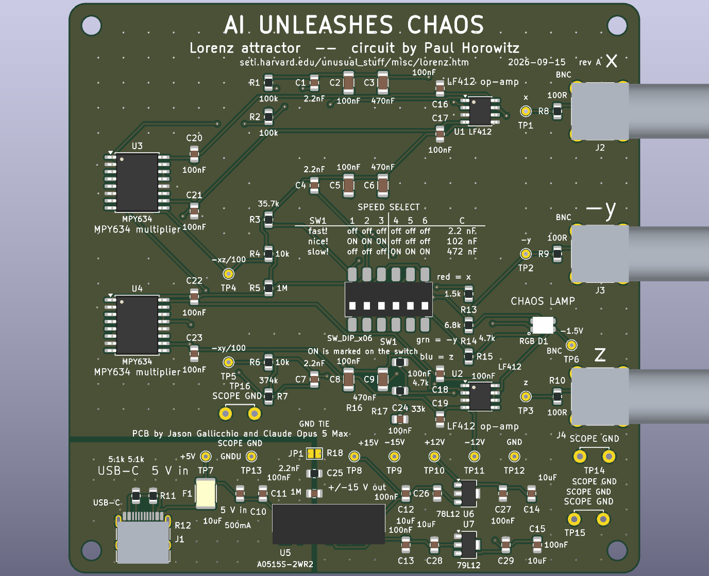 | 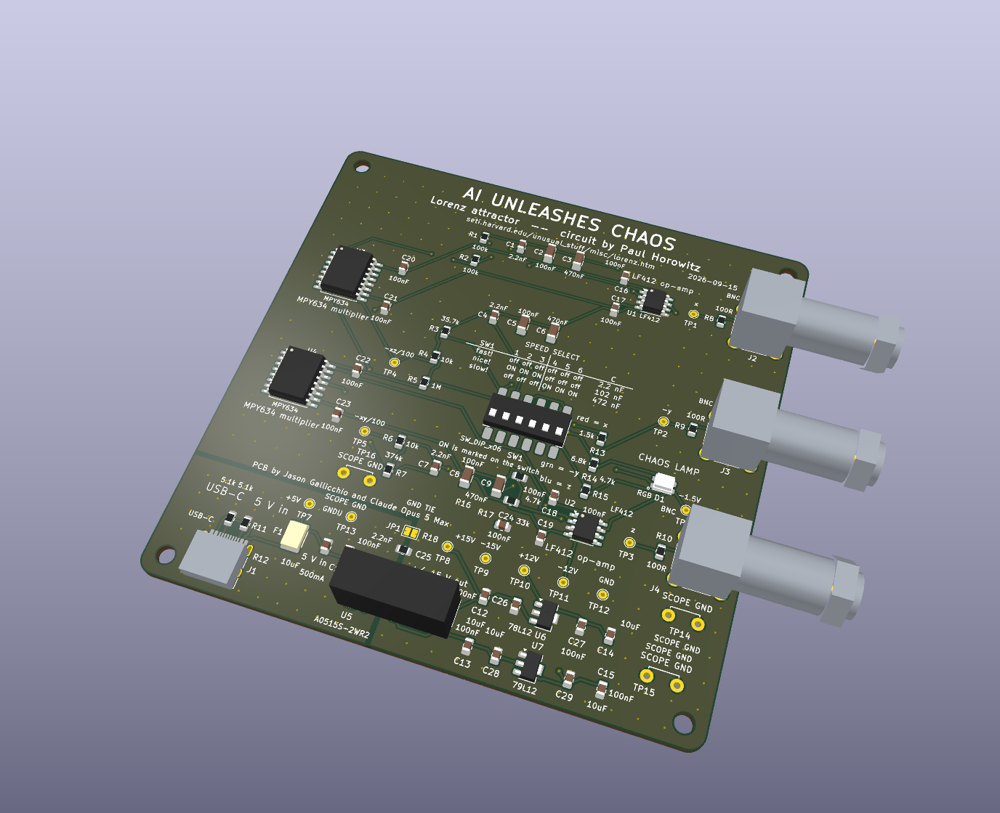 | 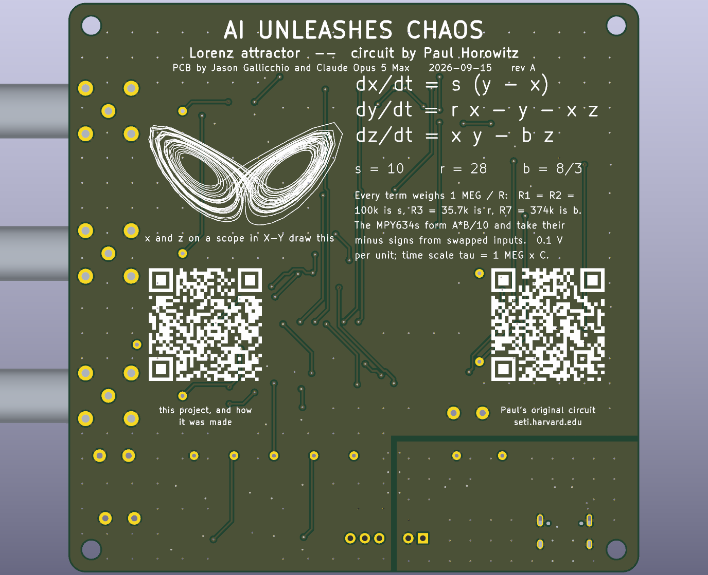 |

[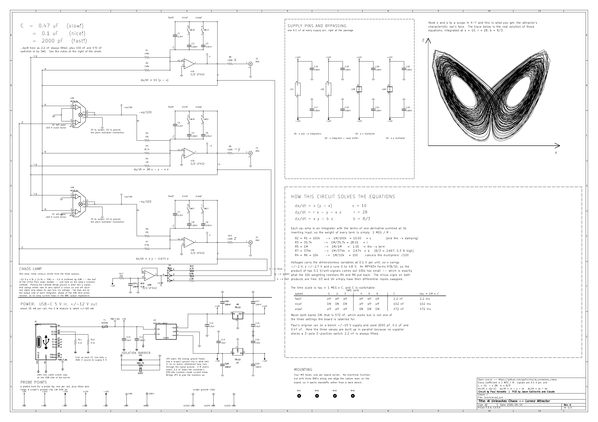](docs/history/response-3/schematic.pdf)

### The chaos lamp

**"It looked like they were taking current from the *input* of an op-amp."**
You were right to be worried, and the drawing was the problem, not the
circuit. The resistors tapped the return lanes on the left of the sheet —
electrically the op-amp output, but those same lanes feed the summing
resistors, so tracing from one of them leads to an op-amp's inverting input.

Redrawn as you describe. Each colour is now fed from **its own integrator's
output node**, tapped on the short column between the op-amp and the 100 Ω
series resistor, and brought down the right-hand margin to the lamp:

```
   U1A out ──┬── 100R ── J2  (x)
             └──────────────────────────┐
   U1B out ──┬── 100R ── J3  (-y)       │   three lanes down
             └───────────────────────┐  │   the right margin
   U2A out ──┬── 100R ── J4  (z)     │  │
             └────────────────────┐  │  │
                                  │  │  │
        U2B ── D1 ──┬─ R15 ───────┘  │  │
                    ├─ R14 ──────────┘  │
                    └─ R13 ─────────────┘
```

The branch leaves on the same side as the BNC, below the jack, and never
touches a return lane. `check_circuit.py` now also asserts that each lamp
resistor and its 100 Ω series resistor share a node, so no lamp current can
ever end up flowing in the BNC output impedance.

**"You claim red and green are x and −y, but your text says red marks the +x
wing and green the −x wing."** Both are true, and it is worth stating why. In
the Lorenz solution **x and y have the same sign 87 % of the time**
(correlation 0.88 — measured, in `lamp_gallery.py`'s own trajectory). So −y is
large and positive exactly when y is large and negative, which is when x is
negative, which is the −x wing. Red is driven by x and lights on the +x wing;
green is driven by −y and lights on the −x wing; they alternate. No
contradiction, just two ways of saying it — and the README now says so.

**"Would maximal LED current affect the LF412's output stages?"** No, and the
numbers say why rather than my saying so. The three colours are on *three
different op-amps* (x is U1A, −y is U1B, z is U2A), so no single output carries
more than about 1.2 mA against the LF412's ±20 mA. Closed-loop output
impedance is about 0.01 Ω, so 1.2 mA moves the output by 12 µV on a 2 V
signal — six parts per million, and the LED's nonlinearity is divided by the
same loop gain. U2B sinks all three at once: 2.2 mA, also nothing.

So the resistors did not *have* to go up. They went up anyway where the
pictures said so, which brings us to:

### A hundred wirings, rendered

**[The gallery is here.](docs/lamp/index.html)** Open it and use the arrow
keys. It is also published at
<https://claude.ai/artifact/C1J4srKW8hEECXYcDzqvy6> if flipping through it on
a phone is easier.

Each picture is 145 seconds of the lamp at the "slow!" setting, read left to
right, wrapping at the end of every row with a black row between passes,
4.7 ms per pixel. To make one I had to answer three questions with numbers:

1. **Voltage to current.** A diode I-V curve anchored on the datasheet's
   forward voltage at 20 mA, with an ideality factor and series resistance,
   inverted on a log grid.
2. **Current to light.** The datasheet's luminous intensity at 20 mA, scaled
   as `(I/20 mA)^γ` with γ slightly above 1, because efficiency falls away
   from the rated current and that is the honest direction at 0.2–3 mA.
3. **Light to a pixel.** Each die's spectrum, built from its peak wavelength
   and linewidth, integrated against the real **CIE 1931 2° observer**,
   summed as tristimulus and converted to sRGB. Brightness is compressed
   before the gamma, the way a dark-adapted eye compresses it — without that
   the pictures are a hard on/off and every shade in between is lost.

`python3 scripts/lamp_model.py` self-tests the colour pipeline: equal-energy
white lands at x = y = 0.3333, ȳ peaks at 555 nm, four published monochromatic
chromaticities match, and — the check that actually matters — **each die's
computed dominant wavelength comes out within 5 nm of the figure on its own
datasheet** (621/520/465 nm). That is an independent confirmation that both
the observer table and the spectrum model are right.

The sweep varies four things: which signal drives which die (6 ways), common
cathode or common anode (the same package, two part numbers, pins 1 and 4
exchanged), the reference voltage from −8 V to +1 V, and four rules for
picking the series resistors. 660 combinations, scored on how much the colour
actually moves and whether anything is visible at all in millicandela — not
against the picture's own exposure, or a lamp running at two microamps scores
beautifully. 505 survive; the gallery shows the hundred least like each other.

Each option carries everything needed to build it: the part number, the two
E24 resistors that make its reference from the ±12 V rails, the three series
resistors, and the peak and mean current per colour.

Worth knowing before you choose:

* **Reference below −2 V** keeps all three above their turn-on voltage all the
  time, and the colour wanders continuously — pretty, but no switching.
* **Reference near 0 V** gives the sharpest wing-to-wing switching, because
  each colour crosses its threshold as the trajectory changes lobes.
* **Common anode** inverts every threshold: a colour then lights when its
  signal goes *low*, which is the half of each signal the current design
  cannot show.
* z never goes negative, so blue behaves differently from the other two in
  every option — that asymmetry is the attractor's, not the circuit's.

The board still carries my pick (x→red, −y→green, z→blue, common cathode at
−1.5 V, 1.5k/6.8k/4.7k) because something had to be drawn. Tell me a number
and it is a four-line change.

### The full design review

`docs/DESIGN_REVIEW.md` has it item by item. The short version: **four bugs**,
and the first one is embarrassing enough to lead with.

**DRC had never read this project's design rules.** `pcbnew` writes a
`.kicad_pro` next to any board it saves, filled with *default* rules, and
`make.py` only put the real one back at the very end — after DRC had run. So
every "DRC: 0 violations" this project has ever printed was measured against
KiCad's defaults, not against the rules I wrote. Handing DRC the real rules
turned up **203 violations** that had been there all along. The zone filler
had the same problem from the other side: it works from the *board's* settings,
and a board made by `CreateEmptyBoard()` carries defaults, so the pour was
backing off 0.25 mm from holes while the rule asked for 0.3.

With that fixed, three more fell out:

* **Every via violated the annular-ring rule** — 0.6 mm on a 0.3 mm drill is
  0.15 mm of annulus against a rule asking 0.25. Vias are now 0.8/0.3, and the
  rule sits at 0.20 because the binding item turned out to be the four shell
  tabs of KiCad's own USB-C footprint.
* **Stitching vias were necking the pour** beside through-hole pads — a 0.08 mm
  isthmus of copper, legal for clearance because it is the same net, and
  pointless anyway: a through-hole pad already connects every layer, so it *is*
  a stitching via.
* **Both multipliers had no designator on the silkscreen** — which is exactly
  what you noticed. The legend placer dodged pads and other legends but not
  package bodies, so `U3` and `U4` were printed neatly underneath the chips.
  It now treats every courtyard as occupied.

On your checklist, with the answers that took actual work:

* **Pin assignments, cross-checked.** `scripts/check_pinout.py` runs every
  build: it writes out each IC's pin table from the datasheet named in the
  code, compares it with the symbol used here, and compares it *again* with
  KiCad's own library where the same part exists — drawn by other people from
  the same document. KiCad ships `Analog:MPY634KU`, which agrees pin for pin
  with what I transcribed from TI's SBFS017A.
  Two things that could have bitten: the SOT-89 tab is pin 2, which is
  **ground on the 78L12 but the input on the 79L12** — so U7's tab sits at
  −15 V; and the A0515S has pins 1, 2, 4, 5, 6 with no pin 3, the gap being
  the module's own isolation barrier, which this board puts the plane split
  through.
* **Packages, rotations, mirrors.** 82 footprints, none flipped, all on F.Cu,
  every rotation 0° or 90°, no mirrored text on the front. Checked
  mechanically, not by eye.
* **Decoupling** was the one place the review changed the circuit. The
  78L12/79L12 datasheets are characterised with 0.33 µF in and 0.1 µF out
  *"located as close as possible"*, and the 10 µF bulk was 15 mm away. Four
  100 nF parts now sit at the regulators' own pins.
* **Power budget.** 20.0 mA on +12 V and 19.5 mA on −12 V against 100 mA
  regulators; 25 mA per rail against a 67 mA module — and, the number that
  actually matters, **3.5× the module's 7 mA minimum load**, below which its
  output climbs. 186 mA from USB against a 500 mA fuse. 75 mW in each SOT-89.
* **Converter noise.** ~100 mVpp of ripple, ~25 dB from the regulator, ~30 dB
  from the op-amps' supply rejection: about 200 µV at an output whose full
  scale is 2 V. That is a hundred times *below* the MPY634's own 30 mV of
  feedthrough, so an RC filter would buy nothing the multiplier does not
  already spend. Physically the switcher and its 6 mm switching loop are
  inside the island in the far corner, behind the 1 mm plane gap.
* **The split ground** is now checked rather than asserted: the build fails if
  any net has pads on both sides of the gap, or if any track or via crosses it.
* **Impedances and input ranges** are tabulated in the review against the
  datasheet limit for each. The one thing worth saying out loud: the BNC
  outputs want a **1 MΩ** scope input. Into 50 Ω the 100 Ω series resistor
  divides by three.

### "If these came back not working, what would it most likely be?"

**Part rotation at the assembler.** Not the netlist, not the values, not the
equations — those are proved from the netlist on every build. The CPL says
which way each part is turned; the fab's library has its own idea of zero
degrees, and where the two disagree a polarised part is fitted backwards. It
is the most common first-article failure there is, and it is the one thing I
cannot check from here.

So `docs/MANUFACTURING.md` now has a **"Check these before you pay"** table:
every polarised part, and which way it should face. JLCPCB renders every part
on the board before you confirm the order — two minutes against that table and
against `lorenz-assembly-top.pdf`, which prints 1:1, closes the gap.

Second most likely: the **BNC footprint**, still drawn from SAMZO's drawing
rather than from a connector in my hand. It is through-hole, so if it is wrong
it will not fit, which is at least loud. Third: a **substituted MPY634** — the
one part with no real second source, where an "equivalent" would not be.

### The layout, rebuilt

You were right that everything was bunched into the lower right. The
multipliers now sit at the **far left**, in the third of the board that was
empty, and everything else spread out behind them.

* Each output row is now one straight line: **op-amp → probe pad → 100 Ω lying
  horizontally → BNC**, with the probe pad's own name (`x`, `-y`, `z`) printed
  beside it. What TP1/2/3 are for should be obvious now: they are the signal,
  ahead of the series resistor.
* **R10 has its designator and its value.** So do both multipliers —
  "MPY634 multiplier" — and both op-amps, "LF412 op-amp".
* The **SPEED SELECT** table has clear board around it: the middle capacitor
  bank moved 4 mm further from its row to make that band, C17 moved away, and
  the `C` column moved in next to the `6` column as you asked.
* The **chaos lamp** has its own quarter of the board between two jacks, with
  its three resistors lying horizontally and coming in from the left, each
  labelled `red = x`, `grn = -y`, `blu = z`.
* The **three rail lamps are gone**, with their resistors. You are right that
  the chaos lamp cannot do anything sensible unless +12 V, −12 V, the
  converter and the USB input are all up, so it *is* the power-on indicator —
  and a dark room now has one lamp in it instead of four.
* The **QR codes are 62 mm apart**, the most the board allows, each in a clear
  20 mm square with no drilled hole in it. Two probe pads moved along their own
  traces to make that true.
* **"PCB by Jason Gallicchio and Claude Opus 5 Max"**, and the back's equations
  and paragraph are flush left.

### Things we could add next

Ordered by how much I think Paul would like them, not by how hard they are.

1. **A fourth output: the multiplier products, on a header.** `-xz/100` and
   `-xy/100` already have probe pads. Two more 100 Ω resistors and a 3-pin
   header would let you watch the *nonlinearity itself* on a scope — the term
   that makes it chaotic rather than a damped oscillator. Cost: two resistors.
2. **A "freeze" switch.** One more DIP pole shorting all three integrating
   capacitors to their summing junctions stops the trajectory dead, and
   releasing it starts from where it stopped. Two poles would give
   freeze/run/reset. It makes the sensitive dependence demonstrable by hand:
   freeze, nudge one output with a finger on a test point, release, and watch
   the two runs diverge.
3. **An r knob.** Replace R3 = 35.7 k with a fixed 27 k in series with a 20 k
   trimmer and you can sweep r from about 18 to 37 — through the Hopf
   bifurcation at r = 24.74, where the attractor *appears*, and down to the
   stable fixed points below it. That is the single most instructive knob the
   system has, and it is one resistor and one trimmer.
4. **A second board's worth of x, on a 3.5 mm jack.** Two boards, one driving
   the other's initial condition, is the classic synchronisation-of-chaotic-
   systems demonstration (Pecora and Carroll). One jack and one resistor per
   board.
5. **A photodiode on the lamp.** Feed it back into the summing junction and
   you have an optically-coupled perturbation you can block with a finger.
   Whimsical, and it makes the lamp part of the circuit rather than an
   indicator.
6. **A slower "very slow" setting.** Both DIP banks on is already 572 nF and
   τ = 572 ms; the silkscreen currently calls that a mistake. It could just be
   labelled as the fourth speed.

My pick would be **3, then 2**: the r knob turns a fixed demonstration into an
experiment, and the freeze switch turns a picture into a proof.

### Still rev A

It stays rev A until you pay a fab. I have not looked at `next_prompt.md`.


## Prompt 4


My favorite patterns are listed below, with things I like about it followed by things that made me ultimately pick a different one:
```
018 a nice range, but I liked others more
038 mostly dark blue with occasional fast swirl through the color wheel. Normally I think I like the ones that are a bit more balanced in huge, but I'll go with this one. Paul likes blue LEDs.
054 mostly red/green with occasional blue. more gradual swirl around color wheel
065 blue with a bit of magenta. not enough green.
072 mostly green with the occasional blue or red. too much green.
079 cool easter colors. doesn't say "Paul" to me.
080 more green than 079, so a fuller range. Similar to 085, which I like slightly better.
085 mostly purple with the occasional green or red. doesn't get blue enough.
088 mostly red with some green and blue. less good than 085. doesn't get blue enough
```

Can you figure out what these all have in common that made me prefer them over the others? Within these, my choice of 038 was ultimately a whim.

As for your ideas of things to add:
1. A fourth output: the multiplier products, on a header: if the things that allow you to "watch the nonlinearity itself" are already on test points, that can be good enough.
2. A "freeze" switch: Not worth it. There's no reasonable way that you can get two of these in the same state and watch them diverge without a lot of extra connections. Maybe I'm not seeing the vision. This seems like a demonstration that is easy to do in simulation, but would require "overriding" X, Y, and Z. Besides, if the synchronisation thing below works, wouldn't disconnecting the place where one circuit nudges the second circuit accomplish this "start from nearly identical initial conditions and watch them diverge" demonstration?
3. An r knob: Let's do it. Paul does not like potentiometers because the wiper always degrades and causes problems. Tom Hayes likes them. And I like the physics demonstration. Let's potentially annoy Paul by putting this in. Be sure to tie the "3rd end" of the potentiometer to the center tap, such that if grit gets under the wiper, it only jumps to its maximum resistance rather than to infinity. My other worry would be that a potentiometer would be too sensitive to get much out of. If you are convinced that someone can turn this thing through different interesting behaviors while  jiggling the knob by a few percent, do it. In the chaotic region, it will probably change the colors on the RGB LED. As long as the knob isn't so sensitive that people can't return to their favorite suite of colors, let's do it…. I mean, go ahead and do it.
4. A second board's worth of x, on a 3.5 mm jack: If we had a whole second copy of this board, could do the "synchronisation-of-chaotic- systems demonstration" by taking one of the BNC outputs (like X) and feeding it into one of the test points (maybe a new testpoint that includes a series resistor? If so, do it. Just to confirm: all of the test points are meant to either be poked at or to have something like a resistor lead soldered through them to grab onto, right? If you take the X output of one, put it through a BNC splitter, send one side to a scope and the other side to your designated testpoint on the other board, could we see the "synchronisation-of-chaotic- systems demonstration"? Is it just "X", or does this work equally well with "-Y" and "Z" for our particular values of components?
5. A photodiode on the lamp: that sounds like it was stray too far afield for this board.
6. A slower "very slow" setting: yes, label it as such, but come up with a cute synonym for "very slow"


To address the "part rotation at the assembler" issue, make sure that each of these components which can be poorly rotated has a clear "pin 1" mark, often a triangle or a dot. If something like this is not in the silk screen, add it either to the footprint of the silkscreen of the board.

Minor:
* Is the USB-C connector close enough to the edge of the board to accommodate nearly all USB-C cables? Some cables have a large plastic body just behind the connector. If you've put it in the official, recommended place, great.
* If a resistor is drawn horizontally in the schematic (as a series resistor), why isn't it placed horizontally on the board? Same with vertical shunt resistors capacitors, which should be vertical. If this poses a serious routing problem, I might understand, but I don't see how it could. I even specifically asked that the 100R resistors that go to the BNCs be horizontal and you even claimed in your last response that "100 Ω lying horizontally," which is not true. (At least the traces are more horizontal.)
* In the schematic, the 3 text labels like "z -> blue" go into the adjacent large text box. That text box can be shrunk (its left border can be moved right, along with the text inside) to accommodate a little more room in this lower right part of the schematic.
* This information like "z -> blue" about how x, y, and z map to R, G, and B should be on the front silkscreen near the RGB LED. If you move things up, you'll have more room.
* The paragraph on the back silkscreen that contains "100k is s, R3 = 35.7k is r, R7 = 374k is b." should be split up into lines in a more readable way. One line, for example, might say, "b is R7 = 374k". It will add a line, but you have room to move the QR code down. Similarly, for two lines "minus signs from swapped inputs.  0.1 V" and "per unit; time scale tau = 1 MEG x C." You should move the "0.1 V" to the next line to keep lines as full sentences where possible.
* The QR codes on the back lost their URLs. These should be under the QR code so people know what they're getting themselves into without bothering with their phones.
* On the front silkscreen, "2026-09-15   rev A" runs into the big "X". There is so much room on the left side to decongest the business end on the right.
* When you update the lamp resistors and configuration, be sure to update the comments around it.
* On the bottom right silkscreen, it says "SCOPE GND" 3 times in a row.
* Just like you moved the multipliers to the left to make more room to spread things out on the right side, you should move the switch up to make more room to spread out the components and labels near the bottom.
* The text "PCB by Jason Gallicchio and Claude Opus 5 Max" and "GND TIE" should be in the opposite order, vertically.
* Shouldn't "x and z on a scope in X-Y draw this" be "x and z on a scope in X-Y draws this" with an s?


## Response 4

*The board and schematic as they stood when this was written — the r knob, the SYNC IN pad, and the lamp wired as option 038.  The schematic links to its PDF.*

| front | | back |
|---|---|---|
| 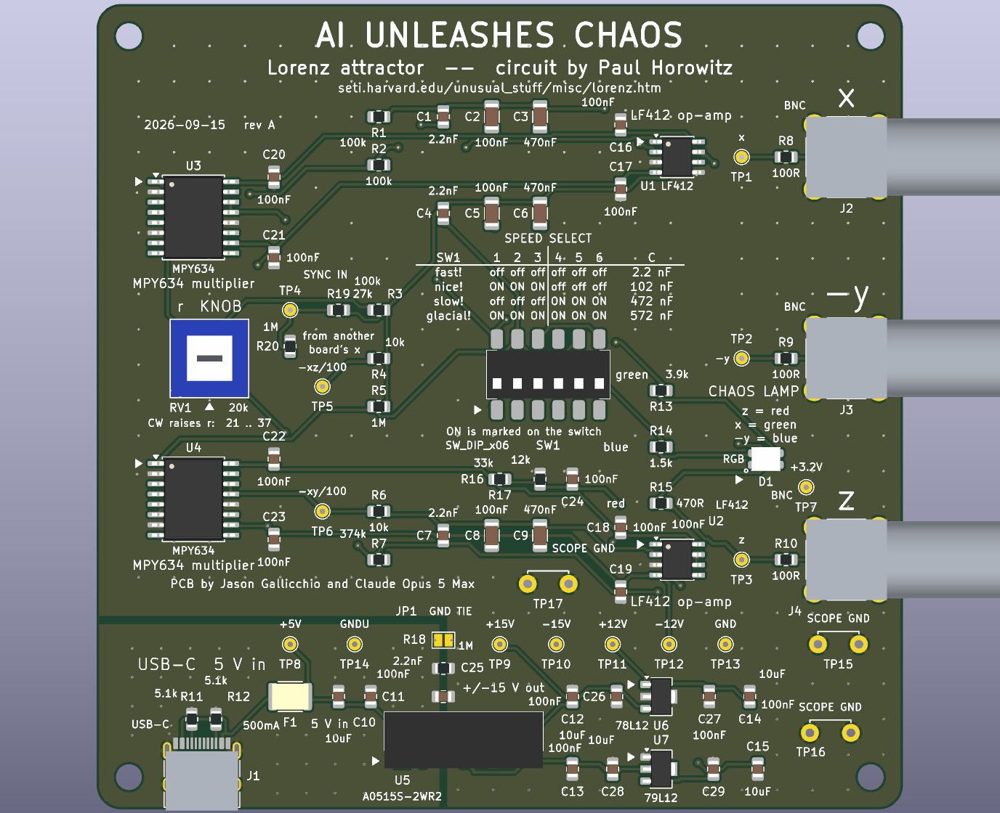 | 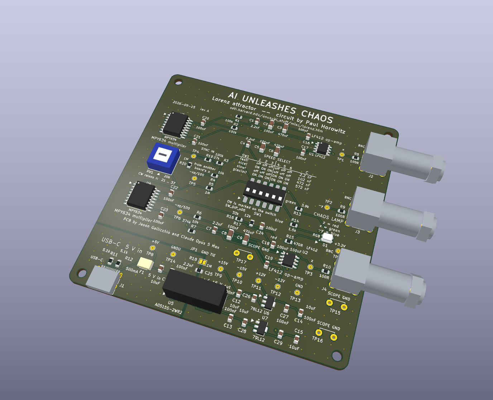 | 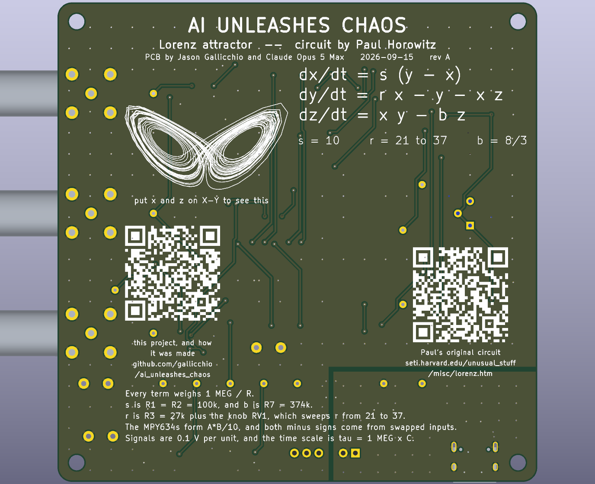 |

[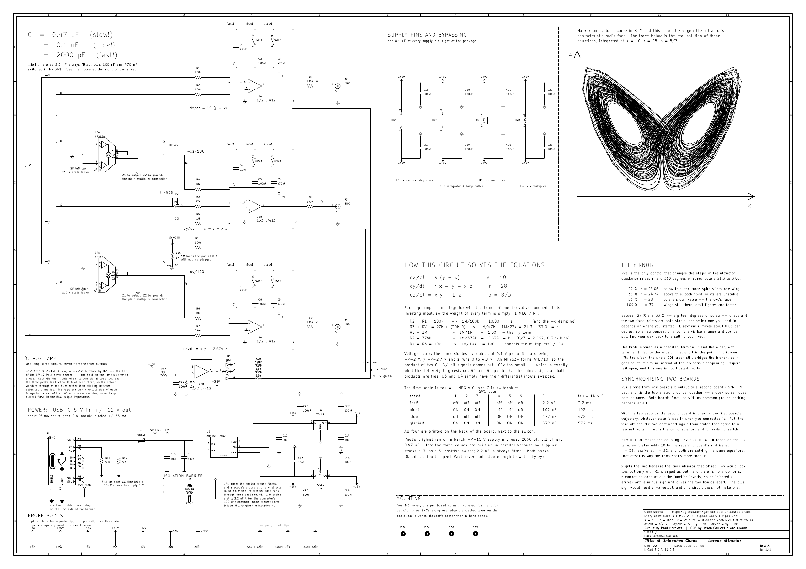](docs/history/response-4/schematic.pdf)

### What your nine favourites have in common

I put all 100 back through the model and measured four things about each:

* **hue coverage** — how much of a 24-segment hue wheel the lamp visits while
  it is lit at all;
* **brightness balance** — the dimmest die's peak divided by the brightest
  die's peak;
* **mean saturation** — how far from white the colour sits, averaged over
  time;
* **lit fraction** — how much of the time the lamp is showing anything.

Medians, your nine against the other ninety-one:

| | your nine | the other 91 |
|---|---|---|
| hue coverage | **0.71** | 0.42 |
| brightness balance | **0.375** | 0.056 |
| mean saturation | **0.269** | 0.347 |
| lit fraction | **1.00** | 0.91 |
| dimmest die's lit fraction | **0.19** | 0.00 |

The last row is the one that explains the rest. In **47 of the hundred** —
nearly half — one of the three dies never comes on at all: the reference is on
the wrong side of that signal's swing, or its resistor is ten times too big, so
the lamp is a two-colour lamp with a third die soldered on for decoration.
**None of your nine is one of those.** Every one of them lights all three. That is why you kept describing them
by hue range ("not enough green", "doesn't get blue enough", "a fuller
range"): you were picking, every time, the ones where all three dies actually
contribute, and rejecting the ones where one had quietly dropped out.

Balance is what makes that possible. `bal` and `i05` — the two resistor rules
that aim for equal *perceived* brightness or a small equal peak current — are
26 of the 100 options but **7 of your 9**. The other three rules size the
resistors for equal current or one value throughout, and green then runs five
times brighter per milliamp than red and swamps it.

Lower saturation follows: three dies that are all on all the time mix, and a
mix sits nearer white than any one primary. So "less saturated" here does not
mean "washed out", it means "actually mixing".

Ranking all hundred by `hue × √balance × lit` puts your nine at **1, 4, 5, 7,
11, 16, 22, 25 and 42** out of 100 — median rank 11 where chance would give
50 — and **038 comes first**. So the whim was not much of a whim.

038 is now what the board does: MHPA3528CRGBCT (common anode) held at
**+3.20 V** by U2B from a 12k/33k divider off +12 V, with **z → red through
470 Ω, x → green through 3.9 k, −y → blue through 1.5 k**. (1.6 k is an
Extended part at JLCPCB and 1.5 k is Basic; the difference is 1.4 % of the
blue peak.) Peak brightnesses come out 38.1, 36.3 and 38.9 mcd — within 8 %
of each other — and U2B sources 3.7 mA at the peak, 1.2 mA on average.

### 2. The freeze switch — yes, exactly that

> *wouldn't disconnecting the place where one circuit nudges the second
> circuit accomplish this?*

Yes, and better than a freeze switch would have. A freeze switch holds one
board's capacitors and then releases them, which starts board 2 from a state
that is *equal* to board 1's but at a *different time*, so half of what you
watch afterwards is that time offset. Pulling the sync wire leaves the two
boards at the same point in state space at the same instant, agreeing to a few
millivolts of op-amp offset noise — which is the textbook initial condition
for the demonstration, and it needs one wire and no extra parts. The idea is
dropped; the sync input does the job.

### 3. The r knob — it is in, and it is not too sensitive

**R3 is now 27 k fixed plus RV1, a Bourns 3386P 20 k single-turn cermet
trimmer**, so `r = 1M / (27k + RV1)` sweeps **21.3 to 37.0**.

*Is it too sensitive?* The 3386's mechanical angle is 310°, and the sweep is
15.8 in r across it. The slope is steepest at the clockwise end, and even
there one degree of screw moves r by **0.088**; at r = 28 it is **0.05 per
degree**. Put another way, to move r by 1 you turn the screw about 17°. That
is a comfortable screwdriver movement, and `check_circuit.py` asserts the
steepest slope stays under 0.15 per degree so the claim cannot rot.

*Is there anything to find?* Here is what the knob actually does to the lamp,
computed by integrating at each r and running the result through the LED
model:

| r | % of rotation | red lit | green lit | blue lit | what you see |
|---|---|---|---|---|---|
| 21.3 | 0 (ccw stop) | 0 % | 100 % | 100 % | **steady** deep blue: the chaos has stopped |
| 24.06 | 27 % | 43 % | 89 % | 85 % | the wings become an attractor again |
| 24.74 | 33 % | 40 % | 89 % | 84 % | the fixed points let go; sustained chaos |
| 28 | 56 % | 28 % | 88 % | 82 % | Lorenz's own value |
| 32 | 78 % | 14 % | 86 % | 81 % | tighter, faster orbit; red thinning out |
| 37.0 | 100 % (cw) | 6 % | 83 % | 78 % | blue-green with rare red flashes |

So the knob is not a fine trim on one behaviour. At the counter-clockwise stop
the lamp **stops changing colour altogether** and sits on a steady blue,
because the trajectory has spiralled into a fixed point; a third of the way
round it starts wandering; and from there to the clockwise stop the red
flashes thin out from two in five to one in seventeen. Between 27 % and 33 %
— eighteen degrees of screw — the chaotic attractor and the two fixed points
are *both* stable and which one you land in depends on where you started,
which is worth knowing about and worth hunting for.

And you can get back: r = 28 sits at 56 % of rotation, and ±3 % of knob is
±0.5 in r, which the table above says is a barely visible change.

**The grit protection is wired as you asked.** RV1 is a rheostat on terminal 3
and the wiper, with **terminal 1 tied to the wiper**. That shorts out the
unused section of track, and if the wiper ever lifts, the full 20 k track is
still bridging terminal 1 to terminal 3, so the branch goes to its *maximum*
resistance — r falls to 21.3 and the attractor collapses to a fixed point —
instead of going open and deleting the `r x` term. `check_circuit.py` checks
that tie explicitly, so it cannot be lost in a later edit.

Paul may still object. The honest defence is that the wiper carries no current
that matters here — it is in series with 27 k feeding a virtual earth, so a
wiper that goes from 0.1 Ω to 1 kΩ with age changes r by 0.05 % — and that the
one failure mode he is right about is the one this wiring turns into a visible,
recoverable symptom rather than a dead term.

### 4. Synchronisation — and no, it is not the same on −y and z

**Yes, every test point is meant to be poked or soldered to.** Each one is a
1.5 mm annular ring on a **0.7 mm plated hole** — a probe tip sits in it, and
a 0.6 mm resistor lead drops straight through and can be soldered on either
side. The three "SCOPE GND" ones are different: two 1.1 mm holes on a 5.08 mm
pitch, meant to have a wire loop soldered through them for a ground clip to
bite on.

**There is now a dedicated one.** `SYNC IN` is a new pad with **R19 = 100 k**
in series into the dy/dt summing junction and **R20 = 1 M** holding the pad at
ground when nothing is plugged in (100 k of open wire on a virtual earth is an
aerial otherwise). Splitter from board 1's x BNC, one side to the scope, the
other side to board 2's SYNC IN: that is the demonstration.

Two practical notes. **The two boards need a ground in common**, and both of
them float on purpose — that is the whole point of the isolated converter — so
a bare wire from the BNC centre to the pad does nothing at all. A coax from the
splitter does both jobs at once, because its screen is board 1's ground; if you
use clip leads, run a second wire between a SCOPE GND loop on each board. The
schematic says so next to the pad. **Loading is negligible**: 100 k (and the
1 M to ground) hanging off an output that drives through 100 Ω is a 0.1 %
error, and the scope on the other leg of the splitter does not notice either.

**Why that junction, and not the others.** The summing junction inverts, so
whatever you inject arrives with a *minus* sign. Diffusive coupling
`g(u₁ − u₂)` is therefore only available where the local term already carries a
**plus** — and in these three equations there are exactly two such terms:
`+r·x` in dy/dt, and `+s·y` in dx/dt. Simulating the two boards at
b = 1M/374k and 28 (RK4, 60 time units, 20 mV of initial mismatch):

| channel | injected into | locks? | threshold | what else must change |
|---|---|---|---|---|
| **x** | `+r·x`, via SJ_Y | **yes** | g ≈ 7 | nothing — turn the receiver's knob down by g |
| **−y** | `+s·y`, via SJ_X | yes | g ≈ 4 | R1 must become 1M/(10−g), and g < 10 always |
| **z** | dz/dt | **no** | — | it cannot be done at all |

*x* is the one that gets a pad because it is the only one that needs nothing
else. The coupling adds g to the receiver's own r, and the receiver has a knob
for r: drive at **r = 32**, receive at **r = 22**, and both boards are solving
the same equations. `g = 1M/100k = 10` is comfortably over the threshold, and
at g = 10 the error falls below a millivolt in **5 time units — 2.4 s at
slow!, half a second at nice!**. That offset of 10 is why the knob was sized to
sweep more than 10.

*−y* would work, but it is not a drop-in. Injecting `−y₁` adds `+g·y₂`'s
partner to dx/dt, and to turn that into `g(y₁ − y₂)` the receiver's own
y-weight has to drop from s to s − g. There is no knob for s, so the receiving
board would need R1 changed from 100 k to 1M/(10 − g) — 167 k for g = 4 — and
g can never reach 10. Not worth a second pad.

*z* cannot be done on this board at all, and the reason is the sign, not
stability.
The junction inverts, so injecting z₁ gives `−g·z₁`, which is *anti*-diffusive:
simulated, the error does not shrink, it grows with g (at g = 2 it ends at 37,
at g = 40 at 180). The sign-correct version — `+g(z₁ − z₂)` — does lock in
simulation at quite modest g, so this is not a Pecora–Carroll obstruction; it
is simply that getting the plus sign needs a **−z** output and this circuit
does not produce one. z's integrator hands you +z.

So: try z. It will fail, it will fail visibly and reproducibly, and the reason
it fails is one sign in one equation, which is a better thing to learn from a
board than another success.

### 6. The fourth speed is called **glacial!**

Both banks ON is 572 nF, τ = 572 ms. It is printed as a fourth row of the
silkscreen table, in the schematic's speed table, and in the bring-up steps.
"Glacial" because it is not just slower — at 572 ms per time unit you can
follow the dot around one wing with your eye and see it decide, which is a
different experience from "slow", not just a longer one.

### Pin 1, marked on every part that can go in turned

Every part that can be fitted the wrong way round — **U1–U7, D1, SW1 and
RV1** — now has a **filled triangle on the front silkscreen, printed just
outside its outline and pointing at pin 1**. The marks are generated from the
real pad and the real courtyard at build time, not from a table, so they
cannot drift away from the footprint; `gen_pcb.py` reports it as a build
failure if any of them has nowhere to go.

`docs/MANUFACTURING.md` now leads its "check these before you pay" table with
the triangles, so the JLCPCB preview can be compared against them part by
part. The custom trimmer footprint also gives pad 1 a **square** pad and a
chamfered silkscreen corner, both of which KiCad's own copy lacks.

### The minor list

**USB-C setback.** It was wrong, and thank you for asking. The receptacle's
mating face sits 3.65 mm in front of its footprint origin, and the origin was
6 mm from the board edge — so the connector opening was **2.35 mm inside the
laminate**, which is exactly the setback that stops a cable with a fat moulded
body from seating. J1 has moved to y = 95.85: the connector body is now half a
millimetre inside the edge, with its printed outline landing exactly on the
0.15 mm silk-to-edge rule. That half millimetre is the most the silkscreen
rule allows without clipping.

**Resistor rotations.** You were right and I had the convention backwards: for
a KiCad chip footprint **rot = 0 is horizontal** (pads at ±x) and rot = 90 is
vertical, and I had written 90 for everything I described as horizontal. Fixed
throughout: R1–R7 (the summing resistors), **R8/R9/R10 (the 100 Ω to the
BNCs)**, R13–R15 (the lamp) and F1 are now rot = 0, lying along the signal
flow, and the shunts R16 and C24 are rot = 90, standing across it. Series
horizontal, shunt vertical, matching the schematic in every case.

**The "z → blue" labels running into the notes box.** The box's left border
moved from x = 283 to x = 292 and its contents with it; the labels were also
dropped from 1.6 to 1.5 mm. `check_schematic.py` measures every text extent on
the sheet and now reports no overlaps at all.

**x/y/z → R/G/B on the front silk.** Printed directly above the lamp:

```
      CHAOS LAMP
       z = red
      x = green
      -y = blue
```

and each lamp resistor also carries its colour word, so a substitution lands
on the right one.

**The back paragraph.** Split into whole sentences, one fact per line, and
moved to the foot of the board where there is room for full-width lines:

```
Every term weighs 1 MEG / R.
s is R1 = R2 = 100k, and b is R7 = 374k.
r is R3 = 27k plus the knob RV1, which sweeps r from 21 to 37.
The MPY634s form A*B/10, and both minus signs come from swapped inputs.
Signals are 0.1 V per unit, and the time scale is tau = 1 MEG x C.
```

**URLs under the QR codes.** Both codes now print their address underneath.
The circuit code needed two lines to fit inside the board, and the codes moved
to clear the trimmer's drilled holes — a QR code is the one thing on this
board that cannot be nudged or shrunk to fit, so everything else moved around
them.

**"2026-09-15 rev A" running into the big X.** Moved to the empty top-left
corner of the board, where there was a whole quadrant of white space and
nothing to collide with.

**Comments around the lamp.** Rewritten: the schematic's CHAOS LAMP block, the
`gen_sch.py` comment above it, `DESIGN_NOTES.md` §5, and the bring-up steps in
`MANUFACTURING.md` all now describe a common *anode* at +3.2 V with the dies
lighting on the way *down*, and quote the real numbers from the model.

**"SCOPE GND" three times.** The three ground loops each printed their name
twice: once as the footprint's Value field and once from a hand-written label
list, and the placer pushed the duplicates apart into a stack. The hand-written
entries are gone; each loop says it once.

**The switch moved up.** SW1 went from y = 52 to y = 46, the middle capacitor
bank from 32 to 26, and the speed table with them. That freed a 14 mm band
across the middle of the board, which is where the lamp's reference chain (R16,
R17, C24) now lives — clearing the bottom third for the credit line, the ground
tie and the power strip's legends. The two multipliers also moved 5 mm further
apart, which is the only place on the board with room for a 9.5 mm trimmer and
the two lines of legend that explain it.

**Credit line and "GND TIE".** Swapped: the credit now sits above, the jumper's
legend below, pinned there by an explicit field anchor so the placer cannot
reorder them again.

**"draw" or "draws".** "x and z" is a compound subject, so **"draw"** was
correct — but it reads like an error, which is nearly as bad as being one. The
caption is now an imperative and sidesteps the question entirely: *"put x and z
on X-Y to see this"*.

### What else changed

* `check_circuit.py` now solves the whole circuit **twice**, once at each end
  of the knob, and requires every coefficient except r to come out identical.
  r is checked as a *range*: it must contain 28, must contain both r = 24.06
  and the Hopf bifurcation at r = 24.78 computed from the board's own s and b,
  must span more than the 10 the sync input adds, and must not move faster
  than 0.15 per degree of screw. 135 checks, all passing.
* The summing-junction walk follows *chains* of resistors now rather than
  assuming one, which is what lets it see 27 k + the trimmer as one branch.
* `check_pinout.py` gained the common-anode lamp (verified against
  `MHPA3528CRGBCT` rev 1 page 2: anode on 1, cathodes 2 blue, 3 green, 4 red)
  and the trimmer's three terminals (Bourns 3386: 1 ccw, 2 wiper, 3 cw).
* The 3386P footprint and its 3D model are **drawn by this project** rather
  than borrowed: the KiCad AppImage ships a reduced 3D set with no model for
  it, and a footprint edited on the board to add one stops matching its
  library and fails DRC. `gen_footprints.py` and `gen_models.py` build it from
  the Bourns drawing.
* `./make.py` is green end to end: 15 pinout checks, 13 colour-model checks,
  135 circuit checks, no schematic text overlaps, 0 ERC, 0 DRC, both QR codes
  decoding, 64 3D models resolving.

## Prompt 5

On all of the DIP switches I've seen, the word "ON" is on top when oriented horizontally. Is "pin one" always on the "off" side as you've drawn the triangle? I hope that JLCPCB's rotation viewer web interface can allow me to get this right.

You added a lot of "pin 1" triangles to footprints that might already contain a smaller, but perfectly good, pin 1 triangle. There is now a both a big and a small triangle on MPY634, LF412, 78L12, 79L12. The RGB LED and DIP switch don't seem to have them, and I'm glad you added them.

I've decided to make SYNC_IN a first-class citizen and give it its own BNC input on the left side of the board. It should be more clear that SYNC_IN is meant to be plugged into another board's "X" output rather than, say, "Z". Maybe call it "SYNC_IN_X" everywhere, although I'll continue to refer to it as "SYNC_IN" when I talk about the existing schematic and PCB. I also want a knob that can set how much "weight" SYNC_IN gets in the sum. I don't have a sense for how much "out X" from one should contribute. You chose to have it contribute through a 100k resistor. If we turned that into a potentiometer (really a resistor and potentiometer in series to keep it from going all the way to zero), what would be a good range to tune it? I want it to go from "it forces a close sync right away" to "its influence is just barely detectable and might take a long time to sync, if at all"? As long as unplugging it completely makes the new circuit act like the original, I think this is worth doing.

I'm confused about how SYNC_IN was drawn on the schematic and PCB. When undriven, it really does add a "+0V" branch to the adder. I think this is fine. But the schematic and the way the board is laid out is confusing: the "sync in" line that comes into the adding junction in the schematic is next to the "dy/dt = r x - y - x z" incoming line, and test point is next to the "-xz/100" testpoint on the board. In the schematic, move the SYNC_IN test point and its two resistors more obviously "add" to the "x" summing-junction input. I would draw the "x" input (after its 27k) and the SYNC_IN input (after its 100k) as joining together first, and then the join continues left to meet the "-xz/100" (after its 10k) and "dy/dt = r x - y - x z" (after its 1M). Redrawing it this way should give the same circuit, but the schematic will be more clear. Remember, this is for Paul Horowitz, the master of cleanly-drawn schematics. Similarly for the PCB, it should be more obvious from the layout itself that SYNC_IN is conceptually meant to add a little perturbation to the "x" input.

To make room for the new BNC SYNC_IN_X, feel free to either move the upper MPY634 further up or to put the BNC there at the top left in line with the "X" output. You should move the date and "rev A" somewhere else, maybe under the "PCB by Jason Gallicchio" text. The date and "rev A" are important to have on there somewhere, but should be the least prominent of the non-component notes.

Change "put x and z on X-Y to see this" to "put x and z on 'scope X-Y to see this".

Thinking of the switches as a binary number, it seems that 1, 2, and 3 are the LSB while 4, 5, and 6 are the MSB. Unless it creates a wiring nightmare, change their order on the switch and update all of the tables. While you're at it, 572 ms is not really "glacial!" compared to 472 ms. Maybe I asked you to be a bit too dramatic in your naming. Maybe change it to "slower!".

## Response 5

*The board and schematic as they stood when this was written — SYNC IN X on its own BNC with a weight knob, the switch reading in binary.  The schematic links to its PDF.*

| front | | back |
|---|---|---|
|  | 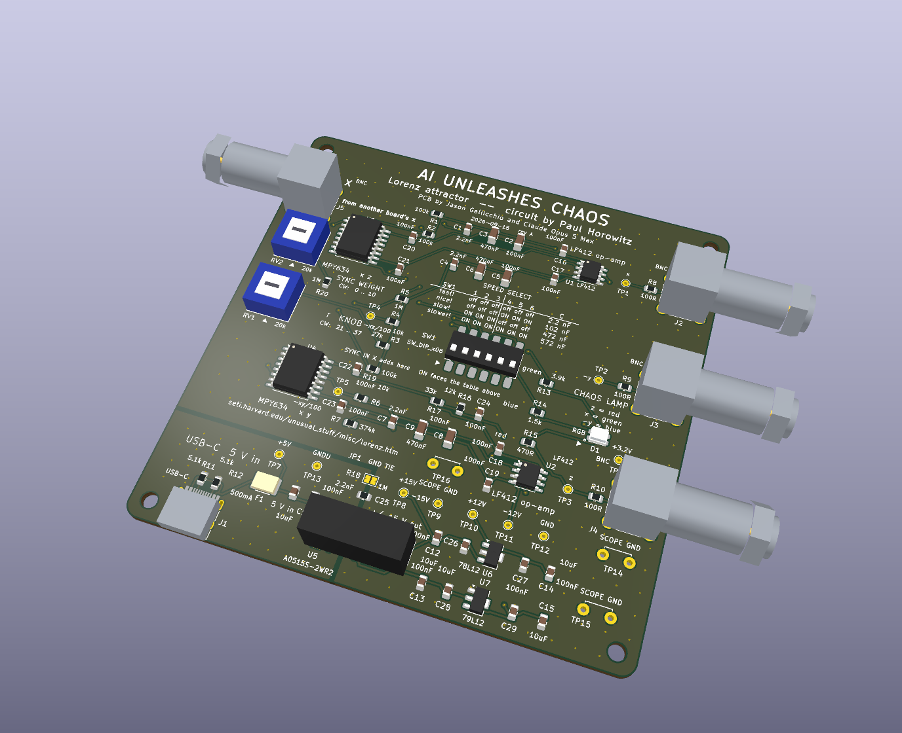 | 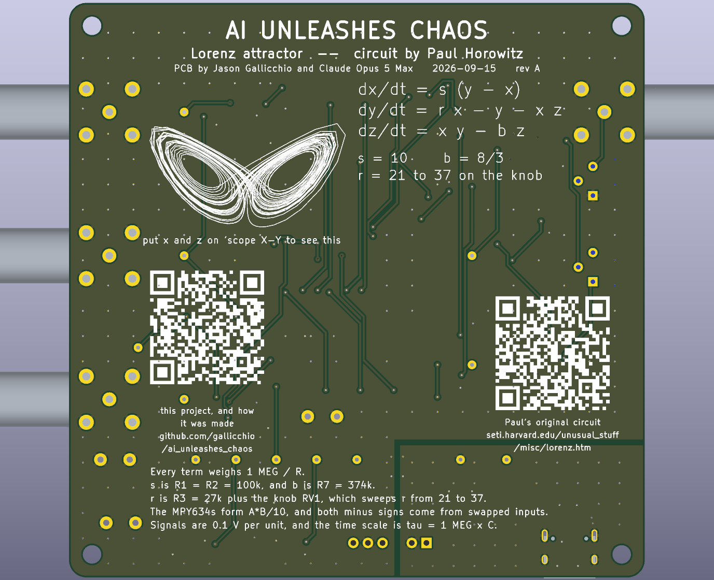 |

[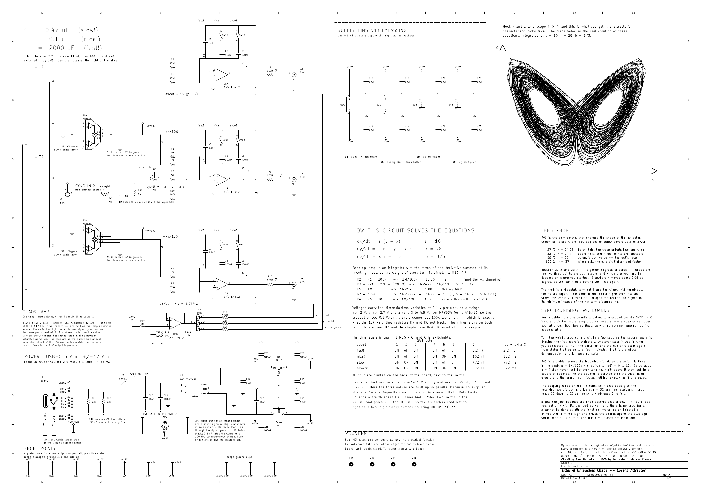](docs/history/response-5/schematic.pdf)

### The DIP switch: yes, pin 1 is on the "off" side

On the KingTek DSIC06LSGET drawing, the six position numbers are printed along
one long side of the body and **"ON" along the other**, so pin 1 is on the side
*away* from the ON legend — which is where the triangle points. KiCad's own
generic DIP-switch footprints agree: pads 1–6 down one side, an `on` marker on
the far side. So your observation holds for this part, and the triangle is on
the side you expected.

It is a convention rather than a law, though, so here is the part that actually
matters: **a DIP switch fitted 180° out is electrically identical.** Each pole
connects pin *k* to pin *13−k*, and a 180° rotation maps *k* → *13−k*, so every
pole still pairs with itself. Nothing shorts, nothing opens, no term changes.
What you lose is the *labelling*: slider 1 ends up where slider 6 should be, so
the two banks swap and the printed table reads backwards. That is a ten-second
discovery at the bench, not a dead board.

The board now prints **"ON faces the table above"** under the switch, so the
part's own ON legend tells you at a glance whether it went in the right way
round.

On JLCPCB: yes. Their order flow renders every placed part on the board before
you confirm, and rotations can be corrected there — that is exactly the check
`docs/MANUFACTURING.md` asks you to make, and its table now leads with the
triangles so you have something specific to compare against.

### The doubled triangles are gone

You are right, and it was sloppy of me to blanket the list. `PIN1_MARKS` is now
**D1, SW1, RV1 and RV2** — the four parts whose own footprints have no mark you
can read on a board. The MPY634s, the LF412s and the two SOT-89 regulators use
KiCad's footprints, which already print a pin-1 dot or a notched corner, and a
second bigger mark beside the first is two marks to reconcile instead of one to
read.

For the record, the lamp and the DIP switch *do* each carry a 0.2 mm dot inside
their own courtyard — mine, from `gen_footprints.py`. It is there for anyone
reusing the footprint and it is not legible on a finished board, which is why
you did not see it and why the triangle earns its place.

### SYNC IN X

**It has its own BNC now**: `J5`, on the left edge, **in line with the x output
on the right edge**, with its barrel pointing off the board the same way the
three outputs do. The silkscreen says `SYNC IN X` above it and `from another
board's x` beside it. Everything in the sources, the schematic, the notes and
the documents calls it `SYNC IN X`.

**The weight knob is `RV2`, and it is a divider, not a rheostat.** You asked for
a resistor and a pot in series so the weight could not reach zero. I want to
push back on one half of that and take the other half seriously, because the
topology turns out to matter more than the range:

* A **rheostat in series** with R19 makes `g = 1M/R`, which is hyperbolic in the
  knob. With a 20 k pot and 100 k fixed, g would run 10 down to 1.7 — and the
  locking threshold, at about g = 7, would sit inside the **first tenth** of
  the rotation. Nine tenths of the knob would do nothing you could see.
* A **divider across the incoming signal**, wiper into a fixed 100 k, makes

  ```
  g = 1M / 100k  ×  (fraction turned)  =  0 … 10
  ```

  which is **linear in the knob**, within 5 % — the wiper's own source
  impedance peaks at a quarter of the 20 k track against R19's 100 k. The
  threshold now lands at about **70 % of rotation**.

And zero is the right bottom end, not a hazard. The danger a rheostat has at
one end is *infinite* gain (R → 0 shorts the input into a virtual earth); zero
gain is harmless, and it is exactly what an unplugged cable gives you. So the
knob turns the sync off completely without touching the cable, which is a
better demonstration, not a worse one. Your actual requirement — "unplugging it
completely makes the new circuit act like the original" — holds either way.

**The range, measured.** Two boards integrated together (b = 1M/374 k, 20 mV of
initial mismatch, the receiver's r knob turned down by g so both solve the same
equations):

| knob | g | what happens |
|---|---|---|
| 0 % | 0 | nothing at all; the boards ignore each other |
| 20 % | 2 | never locks |
| 50 % | 5 | never locks — close approaches, then bursts apart |
| ~70 % | ~7 | threshold |
| 80 % | 8 | locks in 4.7 time units — **2.2 s** at `slow!` |
| 100 % | 10 | locks in 3.1 time units — **1.5 s** at `slow!` |

So the bottom seven tenths is your "influence just barely detectable, might
take a long time if at all", and the top three tenths is your "forces a close
sync right away". The interesting part — bursting in and out of
synchronisation just below threshold — sits right where a knob is easiest to
inch.

Two more things the numbers settle. The maximum weight stays at **10** because
that is what the r knob can take back: drive at r = 32 and the receiver's r
knob reads **32 down to 22 as the sync knob goes 0 to full**, so the two knobs
track each other one for one across their whole travel. And the divider loads
the driving board with 20 k through its 100 Ω output resistor — a 0.5 % error,
which the scope on the other leg of the splitter will not notice.

`R20` = 1 M still holds the wiper node at ground, which is now the *wiper's*
safety net rather than the pad's: if RV2's wiper ever lifts, the sync branch
goes to 0 V and the board behaves as though unplugged. Note that this is the
opposite wiring from RV1, deliberately — RV1's wiper is tied to terminal 1
because an open wiper there would delete the `r x` term, so it must fail to
*maximum resistance*; RV2's open wiper must fail to *no signal*. Different
stakes, different wiring, and `check_circuit.py` asserts both.

### Drawing the sum as a sum

You were right that the old drawing said the wrong thing. Row 2's branches now
run **−y, x·z, x** down the sheet, and the x branch and the sync branch **join
on their own short rail** before that rail continues to the summing junction:

```
   -y  ──[ 1M  ]────────────────────────────┐
   xz  ──[ 10k ]────────────────────────────┤
                                            ├──  SJ_Y
    x  ──[ RV1 ]──[ 27k ]──┬─────────────────┘
                           │
  SYNC IN X ──[ RV2 ]──[ 100k ]──┘
```

Same netlist, but now the drawing says "a perturbation on the x term" instead
of "a fourth term". The board says it too: `R19` is the next resistor down the
summing column from `R3`, with **"SYNC IN X adds here"** printed beside it, and
the whole chain reads left to right along the top of the board — jack, weight
knob, resistor, into the column.

### Making room

The two multipliers moved 9 mm right and the left edge became the input edge:
**J5 at the top, RV2 below it, RV1 below that**, so both knobs are on the same
edge and turn the same way. The back had to move with them — three drilled
parts down that edge punch straight through the equations block, so the
equations went from 2.4 mm to 2.0 mm and the constants split over two lines,
and nothing now reaches past x = 14 mm.

The `MPY634` value fields under the two multipliers are hidden now; the legend
beside each one says **"MPY634  x z"** and **"MPY634  x y"**, which is the
same information plus which product it forms, in less space.

### The title block, swapped

`PCB by Jason Gallicchio and Claude Opus 5 Max` moved up under `Lorenz
attractor — circuit by Paul Horowitz`, so the two attributions sit together,
largest first: whose circuit, then whose board. `seti.harvard.edu/...` took the
credit line's old place in the open band above the power strip. The date and
revision sit directly under the credit at **0.9 mm**, the smallest text on the
front — present, and the least prominent thing that is not a component legend.

### The switch reads as a binary number now

Poles **1–3 carry the 470 nF** and **4–6 the 100 nF**, so left to right the six
sliders count up:

| setting | 1 2 3 | 4 5 6 | C | tau |
|---|---|---|---|---|
| fast! | off off off | off off off | 2.2 nF | 2.2 ms |
| nice! | off off off | ON ON ON | 102 nF | 102 ms |
| slow! | ON ON ON | off off off | 472 nF | 472 ms |
| slower! | ON ON ON | ON ON ON | 572 nF | 572 ms |

00, 01, 10, 11. No wiring nightmare at all: the only change is which pole each
capacitor hangs on, and the `nice!` and `slow!` capacitors swapped positions on
the board to match, so each one still sits over its own pole and no two
branches cross.

And you were right about "glacial!" — 572 ms against 472 ms is a fifth slower,
not a geological epoch. It is **slower!** now, everywhere.

### Small things

* The owl caption reads **"put x and z on 'scope X-Y to see this"**.
* Parts cost went from $72.32 to **$74.31** a board — one more BNC and one more
  trimmer — and the through-hole count from 27 joints to 35.
* `check_circuit.py` is up to **141 checks**, including that RV2 is wired as a
  divider with terminal 3 on the jack and terminal 1 on ground, that the
  maximum weight is no larger than the r knob's span so every setting can be
  compensated, and that R19 and R3 land on the same node.
* `./make.py` is green end to end: 0 ERC, 0 DRC, both QR codes decoding, and a
  clean clone rebuilds byte-identically except the raytraced 3D render.

## Prompt 6

Remove `next_prompt.md` and remove it from the repository if it's there.

Move README.md to `CLAUDE_CODE_CHAT.md`, changing only the title to `Chat with Claude Opus 5 Max about the AI UNLEASHES CHAOS Circuit and PCB`.

Make README.md a very brief summary of the project. Its title should be just "AI UNLEASHES CHAOS", as is printed on the top of the board. The content should be "Lorenz Attractor Circuit by Paul Horowitz in KiCAD" and the first paragraph of Prompt 1. Then a very brief summary which would appeal to the excited nerds of the world, like those on the EEVblog forum. Show the most up-to-date 3D renderings of the board (lorenz-render-iso.png, lorenz-render-top.png, lorenz-render-bottom.png). Link to DESIGN_NOTES.md and CLAUDE_CODE_CHAT.md. If it's not already there, update DESIGN_NOTES.md with information about the RGB LED, which was not in Paul's original (especially how we settled on the right orientation and set of resistors by simulation and color-space mapping, which was a  tour de force. Give minimal bash commands to run make.py, including setting the kicad path. I'll put it from github on a fresh computer and check everything. If it's good, I'll send it off to get built and assembled and sent to me for testing. If it works, we'll see if Paul likes it!

## Response 6

*The board and schematic as they stood when this was written — the board as it stands.  The schematic links to its PDF.*

| front | | back |
|---|---|---|
|  |  |  |

[](docs/history/response-6/schematic.pdf)

*(Written up after the fact: the reply to prompt 6 was given at the terminal
and never recorded here, which is the gap prompt 7 asks me to stop leaving.)*

Done, and verified the way you will do it: fresh `git clone`, `export
KICAD_APPRUN=...`, `./make.py` -- green in 37 s, with every generated file
byte-identical to what is committed except the raytraced ISO render, which
resamples every run.

**What changed**

* **`next_prompt.md` is gone** -- removed from the repository and from disk
  (never read), and added to `.gitignore` so a future scratch draft cannot
  drift back in.
* **`README.md` became `CLAUDE_CODE_CHAT.md`**, with only the title changed.
* **A new `README.md`**: the title as printed on the board, the tagline, your
  first paragraph of prompt 1 verbatim, the three renders, and a short "what
  it is" -- the four speeds, the r knob and its grit-proof wiper, the chaos
  lamp, the isolated ground split that is actually used, `SYNC IN X`, and the
  fact that nothing is hand-edited.  Then the build recipe and links onward.
* **`DESIGN_NOTES.md` gained "Choosing the chaos lamp"** -- why it is a
  four-way decision that cannot be made by inspection; what is in the LED
  model (data-sheet I-V, the nonlinear intensity curve, a spectrum, the CIE
  1931 observer, D65 sRGB, an adaptation curve); the thirteen assertions that
  keep the model honest; the 660 wirings rendered and thinned to 100; and the
  table showing what your nine favourites had in common -- including that 47
  of the 100 have a die that never lights, and none of yours was one of those.

**One real bug found while testing this.**  `./make.py --clean && ./make.py`
failed: the self-tests check the generated symbol and footprint libraries, but
ran *before* the stage that writes them.  A fresh clone was fine, because
those files are committed -- a cleaned tree was not.  The self-tests now run
straight after the libs stage.  An orphaned footprint from an earlier revision
is also dropped.

Two claims I pulled back after writing them: the lamp bullet now says 660
wirings rendered and the hundred most different published, and "Pecora-Carroll
on the bench" became "chaotic synchronisation on the bench" -- our coupling is
diffusive, not their drive-response replacement, and the distinction is drawn
properly in the design notes.

## Prompt 7

I have kicad10 as $HOME/.local/bin/kicad-10.0.6-x86_64.AppImage and when I set

A few minor edits to README.md and the like:

* Make the first text, "Lorenz Attractor Circuit" a link to the seti.harvard page with the circuit.
* After the paragraph that starts with in "In graduate school," add a new paragraph that says: "The entire PCB and additions to Paul's original circuit was designed in a few hours of prompts to [Claude Opus 5 Max](link to the chat markdown). I typed prompts and used KiCAD only to look at the output of Claude's [python scripts](link to scripts), which generated almost everything else."
* Move the "Everything is generated" out of "The interesting bits:" list and into its own paragraph. Change the name of "The interesting bits:" to something like "fun additions to Paul's original circuit.
* Add "git clone https://github.com/gallicchio/ai_unleashes_chaos.git" and "cd ai_unleashes_chaos" and "export KICAD_SHARE_DIR=$HOME/.local/share/kicad/10.0" to the bash instructions with appropriate comments.
* In "CLAUDE_CODE_CHAT.md", the images shown are always of the most recent renders.  Show all 3 historic renders along with a PNG (liked to a PDF) of the schematic at each response stage, and show them inline in each response (yes, you are changing your responses slightly to add these images, but the context of the next prompt depends on what I saw.)
* When I tried to run it on a different computer with a fresh KiCAD 10 AppImage, I got the error below:

```
=== self-tests ======================================================
Traceback (most recent call last):
  File "/home/jason/Downloads/ai_unleashes_chaos/scripts/selftest_rotation.py", line 63, in <module>
    sys.exit(main())
  File "/home/jason/Downloads/ai_unleashes_chaos/scripts/selftest_rotation.py", line 26, in main
    sch.place("Amplifier_Operational:LM2904", ref, "LM2904", x, y,
  File "/home/jason/Downloads/ai_unleashes_chaos/scripts/schlib.py", line 101, in place
    self._resolve(lib_id)
  File "/home/jason/Downloads/ai_unleashes_chaos/scripts/schlib.py", line 55, in _resolve
    node = self.libs.get(lib, name)
  File "/home/jason/Downloads/ai_unleashes_chaos/scripts/sexp_parse.py", line 141, in get
    node = self._raw(lib, name)
  File "/home/jason/Downloads/ai_unleashes_chaos/scripts/sexp_parse.py", line 135, in _raw
    raise KeyError(f"symbol {lib}:{name} not found under {self.share}")
KeyError: 'symbol Amplifier_Operational:LM2904 not found under /home/jason/.local/share/kicad/10.0/symbols'

BUILD FAILED: selftest_rotation.py failed
```

(And: on that computer `/home/jason/.local/share/kicad/10.0/symbols` is empty.)

(And: from now on, reply in CLAUDE_CODE_CHAT.md like you used to reply when it was README.md.)

## Response 7

### The crash: a directory that is called "symbols" but is not KiCad's

`~/.local/share/kicad/10.0/symbols` is where *your own* libraries go.  On a
fresh install it exists and is **empty** — you confirmed that is what it looks
like on that machine.  `kienv.py` accepted any directory that had `symbols/`
and `footprints/` in it, so `KICAD_SHARE_DIR` pointing there passed the check
and then failed 40 lines later, inside a symbol lookup, which is a terrible
place to learn about it.

Two fixes, and I did not document the setting you suggested, because it is the
thing that broke it:

1. **A candidate is only the stock tree if a stock library is in it.**
   `_looks_right()` now requires `symbols/Device.kicad_symdir` (or
   `.kicad_sym`) *and* `footprints/Resistor_SMD.pretty`.  An empty personal
   directory has neither.  If `KICAD_SHARE_DIR` fails that test the build says
   so by name — *"no stock libraries in it — is that your personal library
   directory?"* — and carries on looking instead of dying later.

2. **A plain `.AppImage` now works with nothing set at all.**  The libraries
   inside an unextracted AppImage only exist while it is mounted, so the build
   mounts it: `kicad-*.AppImage --appimage-mount` prints a mount point and
   holds it open, and `kienv` keeps that process alive for the whole build,
   exports `KICAD_APPRUN` and `KICAD_SHARE_DIR` into the environment so every
   script it shells out to shares the one mount, and unmounts on exit.  It
   looks in `~/.local/bin`, `~/Downloads`, `~/Applications`, `~/bin`,
   `~/.local/opt` and `/opt`, and **prefers a KiCad 10 image** — your machine
   has `kicad-9.0.9.1-x86_64.AppImage` sitting next to the 10, and building
   against KiCad 9's libraries would have failed somewhere much less obvious.

I tested it the way you hit it.  With the extracted AppDir moved out of the
way and `kicad-cli` off `PATH`, a fresh clone with nothing but
`~/.local/bin/kicad-10.0.6-x86_64.AppImage` builds green in 39 s and
reproduces every deliverable byte-identically:

```
KiCad 10.0.6
  runner    /tmp/.mount_kicadremXXXXXXXX/AppRun
  mounted   /home/jason/.local/bin/kicad-10.0.6-x86_64.AppImage
  libraries /tmp/.mount_kicadremXXXXXXXX/usr/share/kicad
```

There is also a version guard now: if the KiCad that turns up is not 10.x the
build stops and says which one it found, rather than failing on a missing
symbol much later.

### The README edits

All four done.  One change from what you asked: the bash block has the clone
and the `cd`, but **not** `export KICAD_SHARE_DIR=$HOME/.local/share/kicad/10.0`
— that is the directory that caused the crash.  What is there instead is a
comment saying nothing needs setting if a KiCad 10 AppImage is in one of the
usual places, `export KICAD_APPIMAGE=...` if it is somewhere else, and
`KICAD_APPRUN=...` for an already-extracted one.  Underneath, in as many words,
is a warning not to point `KICAD_SHARE_DIR` at `~/.local/share/kicad/10.0`.

"Everything is generated" is its own paragraph now, and the list above it is
**"Fun additions to Paul's original circuit"**.

### The historic pictures

Every response now opens with the three renders and the schematic **as they
were when that response was written**, pulled out of the git history at the
commit that ended each prompt's work, and stored in `docs/history/response-N/`
(8.7 MB for all six).  The schematic PNG links to the PDF of the same vintage.

* response 1 — `066e515`, four layers, "rails OK" green LED, R3 = 35.7k
* response 2 — `20a537e`, two layers, the isolated split, the lamp, the QR codes
* response 3 — `4f69691`, rebuilt around the multipliers
* response 4 — `4533bb6`, the r knob and the SYNC IN pad
* response 5 — `ca308bd`, SYNC IN X on its own BNC
* response 6 — `5025355`, as it stands

While doing it I found that **Response 6 was never written into this file** —
prompt 6 was answered at the terminal only.  It is there now, marked as
written after the fact, and from here on the replies live in this file.

### Also

`./make.py --clean && ./make.py` still works, and the clean message now names
`docs/history/` and `docs/lamp/` as source rather than build output.


## Prompt 8

I uploaded the gerbers, BOM, and CPL files. There were some issues.

Make a lorenz-cpl_jlc_corrected.csv with the following information:
* The D1 RGB LED has no footprint in their online Component Placements tab. It shows up as the "unknown part" checkerboard
* J2, J3, J4, J5 BNC connectors needed 90 degrees CCW
* R7 shows the 'unknown part" checkerboard. The other resistors are good.
* The footprints for RV1 and RV2 (potentiometers) are never directly over the holes.
* SW1 needed 270 degrees CCW
* U1,U2 needed 270 CCW
* U3,U4 needed 270 CCW
* U5, the voltage converter, cannot rotate onto the pad. It's shifted like the potentiometers. There is no rotation that would put the purple dot over what you drew as what I'm interpreting as the "pin 1" circle.
* U6 needed 180 CCW
* U7 needed 180 CCW

I don't know how to deal with the  "unknown part" checkerboards. I really don't know how to deal with the potentiometer and voltage converter, which are shifted and don't seem to have obvious ways of lining up at all. That seems like a problem with whatever custom thing you wrote for them.

I made a few minor changes to .md files on my own. From now on, when you edit this CLAUDE_CODE_CHAT.md, only Include the new board images if they changed from the last time you included them.

## Response 8

`out/lorenz/lorenz-cpl_jlc_corrected.csv` is built by `./make.py` now, next to
the plain `-cpl.csv`.  Upload the corrected one to JLCPCB and the plain one to
anybody else; `docs/MANUFACTURING.md` has a new **Uploading to JLCPCB**
section that says so, with the table below in it.

### The shifted parts were my bug, and it is fixed

RV1, RV2 and U5 were not a rotation problem at all, which is why no rotation
fixed them.  A pick-and-place file says where the **middle** of a part goes.
For every stock KiCad footprint the anchor is already the middle of the body,
so KiCad's CPL export is right — but I drew those two footprints myself and
put the anchor on **pin 1**:

| part | anchor was | off by |
|---|---|---|
| RV1, RV2 (3386P trimmer) | terminal 1 | 2.54 mm |
| U5 (A0515S DC/DC) | pin 1 | 7.6 mm across, 2.6 mm down |

So JLC was placing the part exactly that far from its own pads, and no angle
can undo a translation — exactly as you found.  Both footprints now have their
anchor on the centre of the body, and the placements moved by the same amount
in the other direction, so **every copper, mask, paste, drill and outline file
is byte-for-byte what you already uploaded**.  Only the CPL changed, plus two
designators on the front silkscreen that follow their parts.

The centroids are now right where the pads say they should be:

```
RV1  9.000, 54.000   pads span y 43.46..48.54, centre 46.0  (CPL y is flipped)
RV2  9.000, 69.000   pads span y 28.46..33.54, centre 31.0
U5  45.535,  8.600   body 35.71..55.36 in x, centre 45.535
```

### The rotations

Taken straight from what you read off the preview, as degrees counter-clockwise
to add.  They are keyed by **LCSC part number**, not by package, because the
angle is a property of JLC's own drawing of that one part:

| parts | LCSC | turned by |
|---|---|---|
| U1, U2 (LF412, SOIC-8) | C15322 | 270 |
| U3, U4 (MPY634, SOIC-16W) | C1523457 | 270 |
| SW1 (6-way DIP) | C54952 | 270 |
| U6 (78L12, SOT-89) | C8615 | 180 |
| U7 (79L12, SOT-89) | C8626 | 180 |
| J2, J3, J4, J5 (BNC) | C41416668 | 90 |

`check_outputs.py` now proves the two placement files differ in nothing but
those angles: same parts, same coordinates, same sides.  Eleven placements are
turned; nothing moves.

**Four parts are still unverified** and are deliberately left at 0, because
their angle has never actually been seen: **D1** (JLC draws it as a
checkerboard) and **RV1, RV2, U5** (which were sitting off their pads, so
there was nothing to judge).  Please look at those four in the Component
Placements view on the next upload — now that the three are in the right
place, their angles will be readable — and tell me any that are turned.

### The checkerboards

A checkerboard means JLCPCB has no drawing of that part to show you.  It does
not mean the part is unavailable — that shows up in the BOM tab, not this one
— and it does not stop the order.  What it costs is the ability to check that
part's orientation, which matters for exactly one of your two:

* **R7 (374k, C2933427)** — harmless.  It is an 0805 resistor; it has no
  orientation to get wrong.  Only the value matters (b = 1M/374k = 2.674), so
  any 374k 1 % 0805 is a drop-in if the checkerboard bothers you.
* **D1 (MHPA3528CRGBCT, C2962095)** — not harmless: it is the lamp, and it is
  polarised.  Two ways to cover it, both now written into MANUFACTURING.md:
  1. Note on the order: *"D1 is a common-anode RGB LED; pin 1 (the anode) is
     the corner marked by the filled triangle on the front silkscreen, at the
     bottom left of the part in lorenz-assembly-top.pdf."*  That drawing
     prints 1:1 and the triangle is in the gerbers, so you and JLC are looking
     at the same picture.
  2. Or deselect D1 from the assembly and hand-solder it.  One PLCC-4 on four
     pads, a minute's work, nothing else affected — and a lamp fitted
     backwards simply never lights, so it is a cheap thing to get wrong.

### What changed on the board

Nothing electrical, and the schematic and the back are identical.  The front
silkscreen has the two trimmer designators pinned under their own squares,
which the anchor move had scattered:

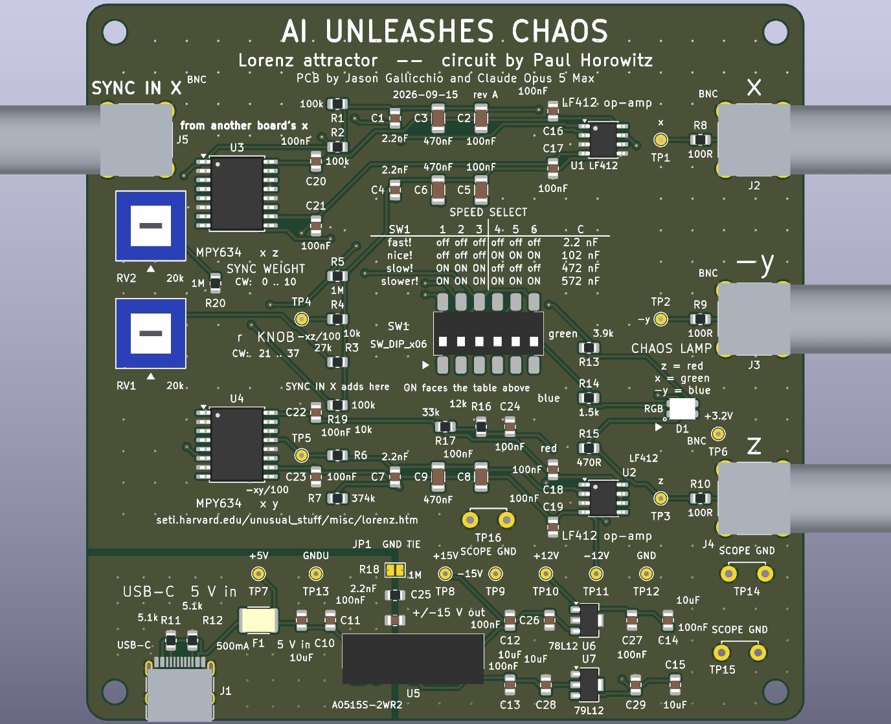

## Prompt 9

*(with four screenshots of JLCPCB's Component Placements viewer: D1 drawn as
a checkerboard between its four pads, U5's model sitting down and to the right
of its outline with JLCPCB's purple pin-1 dot at its top-left, RV1 and RV2
with their models offset, and J1 hanging over the board edge)*

I'll paste in some of what I see in their tool. U5 is still wrong. There's no
way to shift it or move it to make that dot appear over your circle. USB seems
too low. And RV1 and RV2 are still confusing. Do I just leave a note?

## Response 9

Short answer: **you don't even need the note for U5, RV1 and RV2 — they
physically cannot go in wrong** — and there is now a file to paste anyway.
The long answer is that I owe you two corrections.

### First: my "circle" was not on pin 1

You were trying to line JLCPCB's purple pin-1 dot up against my mark, and that
test could never have worked, because my mark was in the wrong place. U5's
silkscreen pin-1 dot was drawn **2.2 mm above pin 1**, inside the body
outline, where it could not collide with anything. Their dot marks the actual
pin; mine marked a spot near it. That is my bug and it wasted your time.

U5 now gets the same filled triangle as the lamp, the switch and the two
trimmers: printed outside the outline, pointing straight at the pad, generated
from the real pad position. The dot inside the outline is gone, so there is
one mark, and lining their dot up against it is now a fair test.

### Second: the offset is JLCPCB's model origin, and I won't fudge it

Their viewer draws a part from **their** model, and that model carries its own
idea of where the middle of the part is. For several of ours it is not the
middle of the body, so their drawing sits beside the pads no matter what the
placement file says. There is nothing in a CPL that can say *use your origin,
not mine* — the only lever is the coordinate, and moving that to flatter a
preview would put a number in the file that is wrong for every other fab and
wrong for their machine.

I checked my U5 footprint against the data sheet again before saying that:
body 19.65 x 7.00 mm, pin 1 2.21 mm in from the left end, pin row 0.9 mm from
the edge, 2.54 pitch with a gap where pin 3 would be. It matches, and the CPL
now gives the middle of that body.

### The part that actually answers your question

I should have led with this. Ask whether each through-hole part's *hole
pattern* maps onto itself under a quarter turn. If it does not, the holes are
their own key and there is exactly one way the part goes into the board:

| part | holes | fits at |
|---|---|---|
| U5, the DC/DC module | 5, with a gap where pin 3 would be | **one orientation** |
| RV1, RV2, the trimmers | 3 in an L | **one orientation** |
| J2–J5, the BNCs | 4 symmetric posts + centre pin | 0, 90, 180, 270 |

So however JLCPCB's preview chooses to draw U5 and the trimmers, an operator
putting legs through holes cannot fit them turned — the legs do not reach.
That is why no rotation made their dot line up: there was nothing to fix. The
BNCs *are* free to turn, which is exactly why they were in the correction
table, and why "barrel points off the board edge" is worth one glance.

`check_outputs.py` now re-derives that keying from the board file on every
build, so it is a fact the build keeps proving rather than a claim I made once.

### The USB-C is not too low

That one is deliberate, from prompt 4: its body is **flush with the board
edge** so a cable with a fat moulded body can seat. It was 2.35 mm inside the
laminate before, which is the fault you asked me to fix. A 3D preview showing
it overhang the edge is showing it correctly.

### So: what to send them

`./make.py` now also writes **`out/lorenz/lorenz-assembly-notes.txt`** — paste
it into the order notes. It covers D1's pin 1, the keying on U5 and the
trimmers, which way the BNC barrels point, and the USB-C overhang.

**D1 remains the one real risk.** It is the only part whose orientation
matters, which their preview cannot draw, and which is not keyed by anything
mechanical. Either the note carries it, or deselect D1 and hand-solder it —
one PLCC-4 on four pads, and a lamp fitted backwards simply never lights, so
it is a cheap thing to get wrong and an easy thing to fix.

Everything else in their viewer looked right to me in your screenshots: D1's
checkerboard is centred between its own four pads, so its *position* is fine,
and no surface-mount part is drawn off its land.

### What changed on the board

Only the front silkscreen, and only around U5 — the dot inside its outline
became a triangle beside pin 1. The schematic and the back are unchanged.


