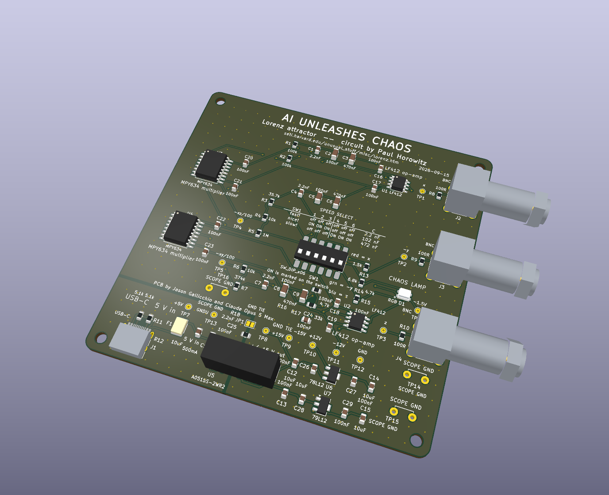
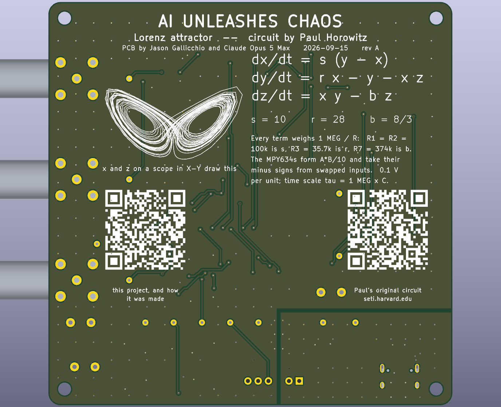
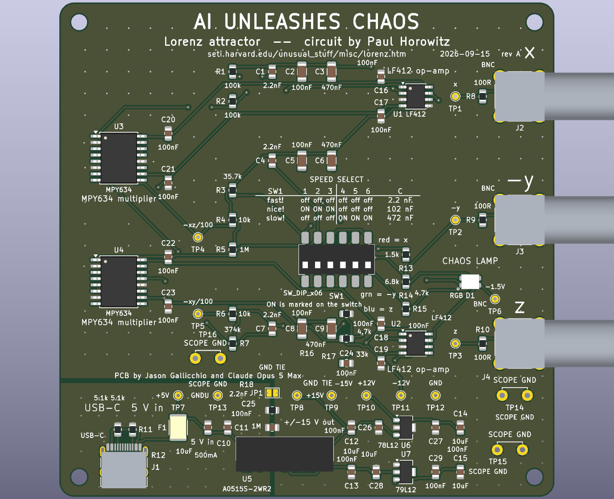

# ai_unleashes_chaos

Lorenz Attractor Circuit by Paul Horowitz in KiCAD

## Prompt 1

In graduate school I worked with Paul Horowitz, of [Art of Electronics](https://artofelectronics.net/) fame. I even contributed a few bits and pieces to the 3rd edition. (I am thanked in the footnotes, one of which simply says, "Jason, again.) I want you to build a nice little present for Paul, which could also live on as an open source project and a kit that people could build.

Make a KiCAD 10 project, schematic, and PCB to implement [Paul's Lorenz Attractor Circuit](https://seti.harvard.edu/unusual_stuff/misc/lorenz.htm).
* It should take power in through a simple USB-C connector. This means that you'll either need to make a negative voltage or change the circuit to power the op amps from only +5V. 
* You may need to make other changes to the circuit. Do it in a way that maintains is simple elegance and educational value.
* Its outputs ()"x", "-y", and "z") should each come out on a BNC connector.
* It would be good to be able to switch the capacitor "C" to the three different values shown: "slow!", "nice!", and "fast!". However, if this explodes the complexity, just pick "nice!".
* Feel free to use modern components if necessary, but try to keep packages as large as is reasonable. SMT is ok, but I want people to be able to hand solder and rework as much as possible (0805 R's and C's, for example).  I want you to take it all the way to gerbers, a BOM, and a CPL file that I can simply upload to a place like JLCPCB, NextPCB Rev 0, or CircuitHub.
* Select components that these places have plenty of in stock, such that that I can order in only one step. I do not want to consign any parts. I do not want to wait for out of stock items.
* Make 2-layer and also a 4-layer version. Do all of the placement and routing yourself.
* You should have a shell script or python file that just "makes" everything on the command line: the schematic, PCB, manufacturing files, and a document with a cost estimate and other manufacturing instructions for me. Your scripts should run as many checks as necessary to ensure that I can just upload the files, "click go", and have working boards show up at Paul's house.
* Make the design rule checks at least as strict as the cheap option's design rules at JLCPCB, NextPCB Rev 0, and CircuitHub.
* Lay out the schematic and the PCB as Paul does in his hand-drawn schematic. The schematic should be a single page. The PCB should fit within the fab and assembly house's discounted small size, but otherwise should be legible and logically arranged.
* The schematic should be in the beautiful "Art of Electronics style" --- the circuit is drawn, and things are labeled in such a way as to immediately answer typical questions that might arise in a reader's mind:
 - I don't want to see labels that disappear and magically reappear elsewhere (except maybe power and ground).
 - If a note belongs with a node or IC, write it right next to the node, not somewhere off to the side.
 - No labels should overlap components or other labels. You can spread things out a bit on the page to allow this to happen, but keep everything within the borders of the page. Really check that this is the case.
* The PCB's silkscreen should make it clear what the inputs and outputs are. 
 - Nothing on the silkscreen should overlap other silkscreen or components. Really check this. Make it beautiful.
 - The silkscreen should have the following on it: "AI Unleashes Chaos", "Circuit by Paul Horowitz", "PCB by Jason Gallicchio and Claude", today's date, and "rev A" in case we need to re-spin.
 - Component values and IC names should also be on the silkscreen (in addition to the reference designators) for educational purposes.
 - Write the equations and "suggested parameters" on the silkscreen. Check that the circuit actually implements them.
 - Include a little drawing of the "owl's face" on the PCB like Paul does in his schematic.
* Do a self-critical design review of the circuit, the way the schematic is drawn, the way the PCB is laid out, and the component and manufacturing selections. Make any changes. Iterate until satisfied.
* I will open the schematic and PCB in KiCAD and give you feedback after you've worked on it for many hours.

Record your response below in this document. Do this regularly, and check things into git as you go.

## Response 1

*(This section is the reply as it was written. Response 2 below changed some of
it — most visibly, there is no longer a four-layer board.)*

Built. `./make.py` regenerates everything from scratch in about 40 seconds and
refuses to finish unless every check passes. Current state:

| check | result |
|---|---|
| ERC | 0 violations |
| DRC + schematic parity, 2-layer | 0 violations |
| DRC + schematic parity, 4-layer | 0 violations |
| circuit checker (reads the netlist, not the drawing) | 75 checks pass |
| schematic layout (205 text items) | no overlaps, nothing outside the frame |
| fab package | all checks pass |

Open `hardware/lorenz.kicad_pro`. The 4-layer variant is `lorenz-4layer.kicad_pro`
and shares the schematic.

### What it is

Your circuit, unchanged: three lossy integrators built from **LF412s** and two
**MPY634s**, with the resistor values exactly as you drew them — 100k, 100k,
35.7k, 10k, 1M, 10k, 374k. The sign inversions still come free from swapping the
multipliers' differential inputs. `scripts/check_circuit.py` walks the exported
netlist, works out what each integrator actually computes from the resistors
really attached to it, and recovers **s = 10, r = 28.01, b = 2.6738** — 8/3 plus
0.27%, which is the 374k. It also checks the virtual earths, the multiplier
hookup, the matched capacitors, the outputs and every supply pin.

Both of your parts are still stocked at JLCPCB: LF412CDR (1037) and MPY634KU
(874). Being able to keep them is why the schematic looks like yours.

### The three things that had to change

**USB-C power.** 5 V in → `A0515S-2WR2` isolated module → ±15 V → 78L12/79L12 →
**±12 V**. The module alone is unregulated and climbs toward ±17 V at this
board's light load, which is too close to the MPY634's ±18 V absolute maximum
to trust across vendors; the regulators pin the rails and strip the converter's
100 kHz ripple. MPY634 is specified from ±8 V, and the largest signal on the
board is z at 4.8 V, so ±12 V is not tight.

**Speed switching.** No supplier stocks a 3-pole 3-position switch, and the three
integrators have to change together. So 2.2 nF C0G is always fitted and a 6-way
DIP switch adds 100 nF (poles 1–3) or 470 nF (poles 4–6) to all three at once:
2.2 nF fast, 102 nF nice, 472 nF slow. The table is on the silkscreen next to
the switch. This is the part of the design I like least — see the review.

**100 Ω in series with each BNC.** A JFET-input op-amp driving a metre of RG-58
will ring. They sit outside the summing network, so the equations are untouched,
and the error into a 1 MΩ scope input is 0.01%.

### What to look at when you open it

- **Schematic** (A2, one page): three integrator rows the way you stack them,
  multipliers on the left, your `C = 0.47 µF (slow!)…` note in the top-left
  corner, and the owl's face top-right — that trace is the real solution,
  integrated by `scripts/lorenz_curve.py`, not clip art. Supply pins and
  bypassing are grouped in their own dashed box, which is the job your "IC
  Pinouts (DIP)" box was doing.
- **PCB**: 100 × 100 mm, inside the discounted size everywhere. Front silkscreen
  is legends, port labels and the speed table; **turn it over** — the back
  carries the equations, your suggested parameters and a large owl.
- **`docs/DESIGN_REVIEW.md`** — what I think is wrong with it, including four
  router bugs the checks caught that each produce a board that *looks* right.
- **`docs/MANUFACTURING.md`** — what to upload, what to select, what it costs.

### Cost

Parts are **$71.69/board**, of which $61.17 is the pair of MPY634s. Two boards
fully assembled, two layers, including through-hole assembly and DHL: about
**$231**, so roughly $115 each. Five is about $74 each. Four layers adds $23 to
the order. `docs/MANUFACTURING.md` breaks it down and is regenerated from the
same parts table the BOM comes from, so it cannot drift.
*(Response 2 added twenty more components — three rail lamps, the chaos lamp
and its drive, the barrier parts — for **$0.17** a board. The current number is
in `docs/MANUFACTURING.md`.)*

### Biggest risk

The BNC footprint is drawn from SAMZO's drawing, not from a connector in my
hand. `out/lorenz/lorenz-assembly-top.pdf` prints 1:1 — please check it against
a real BNC-KYWE before ordering. Everything else on the board is a stock KiCad
footprint or dimensioned from a datasheet I read.

### Pictures

`./make.py` now writes these into `docs/images/` every build, so they cannot
drift from the design.



The back carries the equations, your suggested parameters and the attractor
itself — the trace is the real solution, integrated by `scripts/lorenz_curve.py`:



[The schematic](docs/images/schematic.png) ·
[front silkscreen](docs/images/lorenz-silk-top.png) ·
[back silkscreen](docs/images/lorenz-silk-bottom.png) ·
[front copper](docs/images/lorenz-top.png) ·
[back copper](docs/images/lorenz-bottom.png)

*(Response 1 also built a four-layer board and pictured its two inner planes.
Response 2 dropped it — see below for the measurement that decided it.)*

Every one of these is byte-reproducible except `lorenz-render-iso.png`: KiCad's
renderer jitters a rotated camera, so that one image differs slightly from build
to build even though the board has not changed. Everything a fab reads —
gerbers, drill files, BOM, CPL — is reproducible, with timestamps pinned to the
board date.

Each board also gets a `.step` model (not tracked; it churns) and a
`-stats.txt` in its `out/` folder,
and PDFs of the schematic and both assembly drawings — the top one prints 1:1
for checking footprints against real parts.

### Answering `next_prompt.md`

**Do the schematics differ between 2-layer and 4-layer? Why are there two?**

They do not differ — `lorenz-4layer.kicad_sch` is a byte-for-byte copy that
`make.py` writes from `lorenz.kicad_sch` on every build, so the two cannot
drift apart. It is purely a KiCad requirement: a project is one `.kicad_pro`,
one `.kicad_sch` and one `.kicad_pcb` sharing a basename, and
`kicad-cli pcb drc --schematic-parity` finds the schematic by that basename. No
basename, no parity check — and the parity check is what guarantees the board
you send to the fab really is the circuit that was verified. I kept the copy
tracked rather than generated-only so that either project opens straight from a
clone without running anything first.

The only real differences between the two boards are the stackup and what is
poured on it: two layers puts ground on both sides, four puts signals outside,
a solid ground plane on In1 and a +12 V plane on In2. Same placement, same
schematic, same BOM, same pick-and-place.


## Prompt 2

Build process:

* On a different computer (my laptop), when I run make.py after setting `KICAD_APPRUN`, I get the following, which may indicate that not everything in this git repo is self contained. This should be reproducible by someone who just clones it off of github and types `./make.py`.
```
$ ./make.py 
KiCad 10.0.6

=== self-tests ======================================================
Cannot locate KiCad shared data (symbols/footprints).

BUILD FAILED: selftest_rotation.py failed
```
* Add a `make.py --clean` to remove everything that is generated by make.py. In addition to being good practice, this is useful so that people can know what is generated and what needs to live in git.


Schematics:

* I made a datasheets directory and download some datasheets there. You should make sure they are all downloaded: all parts and connectors and anything else that would be useful. I can get you any that you need. Do not check this into git for copyright reasons.
* Do the schematics differ at all between 2-layer and 4? If not, why are there two different schematics? Is this just a KiCAD requirement? When I have both the schematic and PCB open, I can't seem to click on one to highlight that spot in the other. Do they need to get linked in some way for that to work?
* Two web pages URLs along with QR codes for them should go on the back of the PCB:
 - <https://seti.harvard.edu/unusual_stuff/misc/lorenz.htm>
 - <https://github.com/gallicchio/ai_unleashes_chaos>
* The little table that explains the switch settings could be more clear
* You might have misinterpreted my request which came up in your "One label per signal net" section of your DESIGN_REVIEW.md document. I meant one human-readable comment-type label. The internal KiCAD labels can be whatever they need to be for the best error checking.
* There should be places to attach the ground clips of oscilloscope leads and marked (labeled) test points (places to probe) for all of the DC voltages and the other interesting places to probe in the circuit that you marked in the schematic, like "dx/dt = 10 (y - x)", "-xz/100", and "dy/dt = 28 x - y - x z".
* There should be at least 3 "rails OK" LEDs, one for USB and one for each of the regulated rails. They can be different colors so that one can know at a glance which one is not working. Or they could be all dim white LEDs if you do the following:
* Does it make sense to put LEDs on the x, -y, and z outputs? Or an RGB LED, where each color is driven by one of the outputs to make a chaotic color in "slow" mode? The advantage is that there would be something to look at even if you didn't plug in the BNCs to a scope. A resistor and LED would have a non-linear response, but I'm not sure if anything would be gained by making a proper proportional current drive, and I'm not sure how I'd deal with negative-going signals.
* I'm not familiar with the A0515S-2WR2. If it's truly isolated, as the schematic symbol suggests, would it be a good idea or a bad idea to keep the USB ground separate from what eventually becomes the oscilloscope ground to avoid ground loops? Or would that introduce more problems than it solves? You do acknowledge that "the isolation is not used," whose text you should keep on the schematic if you decide to continue not isolating it.

PCB:

* Does the 4-layer  board buy you anything useful here? Maybe with my pedagogical silkscreen requests, the board size is already going to be large and identical in size to the 2 layer. Is the 4-layer worth it? If it's not worth it, just drop it from the project.
* Should "rails OK" be right next to the LED? Does it really only light if both rails are, in fact, ok?
* The 3D model is missing some parts, especially the DIP switch and the A0515S device that makes +-15 V.
* The PCB should also include the text "Circuit by Paul Horowitz" and the web page, just like the schematic does, not only "PCB by Jason Gallicchio and Claude". Please, that's what he'll see first!
* The table that explains the switch settings could be more clear. At a minimum, the text should be rotated so that the words "off" and "ON" in each column should actually be under the 3 switches that they refer to. Make a silkscreen bar that is drawn coming perpendicular to the DIP switches, in between the columns. Doing this carefully should also solve my second problem with this, table, which is that the label "1-3" is above both columns of the off's and ON's, whereas "4-6" is above the capacitor values... and "fast", "nice", "slow" should be associated with rows of the table.
* The text "MountingHole" and its reference designator does not need to be on the silkscreen.
* The PCB layers in docs/images/ are mostly whitespace. Why aren't these images only as big as the PCB outline?


Misc:

* As part of the build process, generate PDFs and PNGs and 3D renders of the schematic and PCBs and include them here, as you've started to do.
* Continue calling this "rev A" until I actually pay to fabricate a board.
* As you are working, I might be updating next_prompt.md, but don't look at it until I put its content here and tell you to look at it.


## Response 2

*(As written. Response 3 changed two things here: the three rail lamps are
gone, because the chaos lamp cannot light unless every rail is up, and the
lamp is now fed from each integrator's output node rather than from the return
lanes.)*

Everything below is built by `./make.py`, which now ends with **BUILD OK** only
if ERC, DRC with schematic parity, 116 circuit checks, the schematic layout
check, the fab-package checks and — new — a QR decoder all pass.



### The isolation: yes, use it

The A0515S-2WR2 really is isolated — 1 kV, no DC path — and the board was
throwing that away. It doesn't now. There are two grounds:

* **GND**, everything downstream of the converter: both op-amps, both
  multipliers, the BNC shells, the chaos lamp, every probe pad but one.
* **GNDU**, everything upstream: the USB-C connector *and its shell*, the CC
  pull-downs, the input bulk capacitors, the +5 V lamp.

They are two separate copper pours with a 1 mm gap, and U5 sits across the gap
with its own 5.08 mm barrier over it. You can see the island in the
[front copper](docs/images/lorenz-top.png), bottom left.

This is worth doing on *this* board specifically. Its whole purpose is to be
watched on a scope, and a scope ground clip is bonded to mains earth. Tie the
grounds and the loop runs scope earth → BNC shell → board ground → USB cable →
laptop → earth; whatever that loop carries lands on signals whose full scale is
2 V. Isolated, the scope clip is the only thing deciding where analog ground
sits — which is exactly what you want when you are looking at 100 mV of chaos.

It is not left completely adrift, because that would trade one problem for
another. Across the barrier: **R21 = 1 M** drains static, **C25 = 2.2 nF**
gives the converter's ~100 kHz common-mode current a way home (720 Ω there,
1.2 GΩ at 60 Hz), and **JP1** is an open solder jumper marked `GND TIE` —
bridge it and the two grounds are hard-tied again. Both R and C values were
already in the BOM, so the whole thing costs two 0805s and no new order codes.

The "the isolation is not used" note is gone from the sheet, replaced by a
labelled `ISOLATION BARRIER` block that says what JP1 does.

### The chaos lamp, and the negative-going problem

Yes to the RGB LED, and the answer to *"I'm not sure how I'd deal with
negative-going signals"* turns out to be the nicest part of the design: put
the **common cathode below ground** and let each colour threshold itself.

U2B — the half of U2 Paul never needed, previously parked as a grounded
follower — buffers −1.50 V from a 4.7k/33k divider and holds the lamp's
cathode there. Then:

| colour | driven by | lights when | peak current |
|---|---|---|---|
| red | x through 1.5k | x > +0.25 V — the **+x wing** | 1.16 mA |
| green | −y through 6.8k | y < −1.10 V — the **−x wing** | 0.23 mA |
| blue | z through 4.7k | z > +1.10 V, brightness tracking z | 0.79 mA |

So red and green **alternate as the trajectory switches wings** — which is the
chaos itself, visible without a scope — while blue brightens with z and drops
out at the bottom of each excursion. In `slow!` (τ = 472 ms) that happens at a
few hertz; in `nice!` it is a flicker; in `fast!` it averages into a colour.

On the nonlinearity you raised: a resistor and an LED is a soft threshold, and
here that is a *feature*, not a defect. A proportional current drive would give
a smooth fade and lose the wing-switching, which is the thing worth seeing.
What did need care was perceived brightness — green is about five times
brighter per milliamp than red and sits where the eye is most sensitive — so
the three resistors are sized from the datasheet's luminous intensities rather
than for equal current.

The lamp taps the op-amp outputs *before* the 100 Ω series resistors, so none
of its current flows in the BNC output impedance. Total peak draw is 2.2 mA,
which U2B sinks without noticing. `check_circuit.py` recomputes the reference,
all three thresholds, all three peak currents and the worst-case reverse
voltage on each junction from the resistors actually fitted, so those numbers
cannot drift away from the board.

### Three rail lamps, and what "rails OK" was hiding

You were right to ask. The old single green LED hung off +12 V and said
`rails OK`, which was a lie: it knew nothing about −12 V and nothing about the
USB input, so it could sit there looking healthy with half the board dead.

Now there is one lamp per rail, each with its own name on the silkscreen right
beside it:

| lamp | rail | colour | current |
|---|---|---|---|
| D1 | +5 V (USB side of the barrier) | yellow | 1.27 mA |
| D2 | +12 V | green | 2.09 mA |
| D3 | −12 V | white | 0.98 mA |

Three different colours as you suggested, and all three are JLCPCB **Basic**
parts, so the extra colours cost nothing in setup fees. Not red: red reads as
"fault" when here it would mean the rail is *up*, and red/green/blue are
already spoken for by the chaos lamp. D3 runs ground → LED → resistor → −12 V,
so it lights only if the negative rail is genuinely there.

### Probe pads and scope grounds

Thirteen plated holes, each with what it probes written next to it on the
silkscreen (the name is the symbol's value, so the legend cannot disagree with
the netlist):

* **rails:** +5 V, +15 V, −15 V, +12 V, −12 V, GND, GNDU
* **signals:** x, −y, z, −xz/100, −xy/100, and −1.5 V (the lamp reference)

Three **SCOPE GND** anchors: two 1.1 mm holes on 5.08 mm centres. Push a loop
of wire — a resistor lead offcut does — through and solder it, and an alligator
clip has a post to bite. They cost two drill hits each and nothing else. One is
beside the BNC column, one beside the probe row, one in the middle of the
board.

**One deliberate omission.** You listed `dx/dt = 10 (y - x)` among the
interesting places to probe. There is no pad on the summing junctions, and
that is a decision rather than an oversight: a summing junction is a virtual
earth, so its *voltage* is zero by construction and carries no information —
dx/dt exists there only as a **current**. It is also the one node on the board
where a probe changes the answer: 15 pF against a 1 MΩ scale of impedances is a
15 µs pole hanging off the integrator's input. What *is* worth doing is
checking that each junction really sits at 0 V, and for that the summing
resistor pads are the right place to put a tip. The multiplier outputs, which
are real voltages carrying −xz/100 and −xy/100, do get pads.

### The four-layer board: dropped, and here is the number

On the routed two-layer board, tracks cover **1.2 % of the back copper** and
2.6 % of the front. The back is therefore already 98.8 % of an unbroken ground
plane. A dedicated plane layer recovers that last one per cent — against
roughly four times the bare-board price, a second gerber set for somebody to
pick the wrong one of, and (now) an isolation split that would have to be drawn
on four layers instead of two. The fastest thing on this board is a 100 kHz
switching converter and the signals are DC to about 700 Hz.

So it is gone. `route.py` and `gen_pcb.py` still take a layer count and the
four-layer code paths are in git history; nothing in the shipped package
mentions it.

That also answers the older question about two schematics: there is now one
schematic, one board, one project. The duplicate only ever existed because
KiCad binds a project to `<name>.kicad_pro` / `.kicad_sch` / `.kicad_pcb` by
basename, and `kicad-cli pcb drc --schematic-parity` finds the schematic that
way.

### Cross-probing: fixed

It wasn't working because nothing on the board said which symbol each footprint
came from. Each footprint now carries the symbol's UUID as its sheet path plus
`sheetname`/`sheetfile`, and `lorenz.kicad_pro` carries the root sheet in its
`sheets` list. Click a part in either editor and it highlights in the other.
(`make.py` regenerates the project file as its *last* step, because saving a
board through `pcbnew` rewrites `.kicad_pro` and drops that entry.)

### QR codes

Both URLs are on the back, as codes and as text. Nothing in KiCad draws a QR
code and the build has to work from a bare clone, so `scripts/qrcode_gen.py` is
a QR encoder written for this: byte mode, versions 1–6, error correction L or
M, Reed–Solomon over GF(256), all eight masks scored. Both codes are version 4
at level M — 33 × 33 modules, 0.6 mm each, so 19.8 mm square.

Writing your own encoder for something a phone camera has to read is a good way
to ship a beautiful, unreadable rectangle, so it is checked three ways:

1. `python3 scripts/qrcode_gen.py` self-tests: the 32 published format words
   come out of its BCH, 36 symbols round-trip through a decoder written
   alongside it (which verifies every Reed–Solomon block's syndromes), and the
   finder patterns are checked module by module.
2. Against two independent implementations. Its data placement, Reed–Solomon
   and format information match the `qrcode` package **module for module**; its
   mask penalty scoring matches `segno`'s on 200 random matrices. Both were
   installed only as oracles and are not build dependencies. (The two libraries
   disagree with *each other* on mask choice — `qrcode` implements the
   pre-2015 rule 3 and `segno` scores a format region it hasn't written yet —
   so the self-test checks what is actually normative.)
3. `check_outputs.py` reads the rectangles back out of `lorenz.kicad_pcb`,
   samples them into a matrix and decodes it. That check is part of every build.

Two details that would each have shipped a broken code. The modules have to
**touch** — a decoder locates the symbol by the 1:1:3:1:1 run lengths across a
finder pattern, and I measured that even a 10 % gap is fatal — so each run of
dark modules in a row is drawn as one filled rectangle. And the code has to be
**mirrored in board coordinates**, exactly like back-layer text, or it reads
correctly only through the board; I settled that by plotting a mirrored legend
beside it and seeing which way round the legend read. As a final check, OpenCV
read both codes straight out of the plotted `B.Silkscreen` PDF.

### The switch table

Rebuilt in both places.

On the **board** it sits directly over the switch: each `off`/`ON` cell is
centred on the slider it refers to, there is a silkscreen bar between the two
banks of three, the speed names the row, and the capacitance and time constant
are in their own columns on the right with their own header. Getting the six
cells over the six sliders is what fixed the "`1-3` is above both columns"
problem you spotted — the columns *are* the sliders now.

```
                     SPEED SELECT
     SW1    1    2    3  |  4    5    6      C
    -----------------------------------------------
    fast!  off  off  off | off  off  off   2.2 nF
    nice!  ON   ON   ON  | off  off  off   102 nF
    slow!  off  off  off | ON   ON   ON    472 nF
              [ the six sliders ]
           ON is marked on the switch
```

That band had to be made: the middle capacitor bank moved 4 mm further from its
row so the legend has somewhere to go that lines up with the sliders. On the
**schematic** it is now a drawn table with ruled columns rather than three
sentences, plus a line saying what happens if you turn both banks on.

`ON` is printed on the switch body itself, and I have not held one, so the
silkscreen says that rather than guessing which way the sliders push.

### Paul's name and his page, on the front

Front silkscreen, top of the board, in this order and these sizes:

```
             AI UNLEASHES CHAOS                       2.8 mm
    Lorenz attractor  --  circuit by Paul Horowitz    1.6 mm
     seti.harvard.edu/unusual_stuff/misc/lorenz.htm   1.1 mm
 PCB by Jason Gallicchio and Claude   2026-09-15  rev A
```

The back carries the same title block, the equations, the attractor and both QR
codes.

### Labels

Understood — one human-readable *comment* per signal, and the internal KiCad
labels can be whatever gives the best error checking. So the sheet now names
the three summing junctions `SJ_X`, `SJ_Y`, `SJ_Z` (they had auto-generated
names before, which made every check message unreadable), while the drawn `x`
still appears beside the bus every time it leaves for a load, the way Paul does
it. A KiCad label is a connection; a drawn note is not.

### Datasheets

`python3 scripts/get_datasheets.py` pulls one PDF per LCSC code in
`scripts/parts.py` — 30 order codes, connectors included — plus Paul's page, into
`datasheets/`. It skips anything already there, including files you downloaded
by hand under a different name. The directory is in `.gitignore`: not checked
in, for copyright.

### Other items

* **The 3D model was missing parts.** The DIP switch, the A0515S module and now
  the RGB lamp all have hand-written VRML stand-ins in
  `hardware/lib/lorenz.3dshapes/`. The reason they were missing at all is worth
  recording: `gen_models.py` existed but `make.py` never called it, so a fresh
  clone had no models. It is wired in now, and `check_outputs.py` fails the
  build if any footprint names a model that is not on disk. (Mounting holes,
  probe pads and the solder jumper are allowed to have none — nothing is
  fitted there.)
* **`MountingHole` on the silkscreen** — gone, along with its reference
  designator. The hole is self-explanatory.
* **The layer images were mostly whitespace.** They now crop to the ink rather
  than to an assumed corner, which also fixed a bug I had not noticed: the
  back-silkscreen image was **completely blank**, because a mirrored plot lands
  on the other side of the page and the old fixed crop was looking at the wrong
  corner.
* **`make.py --clean`** removes everything the build generates and prints what
  it removed, so the list doubles as the answer to "what is generated and what
  has to live in git". It leaves KiCad's own `.kicad_prl` alone if KiCad has
  the project open.
* **Still rev A**, and it stays rev A until you pay a fab.
* I have not looked at `next_prompt.md`.

### What the build does now

```
$ ./make.py
=== self-tests ======================== rotation mapping vs KiCad's netlister
=== symbol and footprint libraries ==== 6 symbols, 5 footprints, 6 3D models
=== schematic ========================= ERC 0, 116 circuit checks, 316 text
                                        items with no overlaps
=== PCB: lorenz (2 layers) ============ 84 footprints, 581 tracks, 438 vias,
                                        4 zones, DRC 0 with parity
=== manufacturing outputs ============= gerbers, drill, BOM, CPL, PDFs, PNGs,
                                        3D renders, STEP; both QR codes decoded
=== documentation ===================== docs/MANUFACTURING.md
=== project files ===================== .kicad_pro last, so cross-probing works
```


## Prompt 3


On your brilliantly-named "chaos lamp":
* The way you drew the RGBs in the schematic was very concerning. For a while, it looked like they were taking current from the *input* of an opamp rather than the *output*. Tracing through the circuit, I think it's ok, but why aren't the RGB LED's resistors and the LEDs themselves hanging down from a spot just before each signal goes through its 100R resistor on its way to the output BNC?
* In your schematic, you claim that red and green are x and -y, but in much your text, you say things like "Red therefore marks the +x wing and green the -x wing". Is this wrong, or does a positive x often imply a negative y in the Lorenz solution?
* If the op-amp outputs were all toward the top of their ranges, and the LEDs were drawing maximal current, would it affect the LF412's output stages? If so, increase the value of the RGB LED's resistors. The "CHAOS LAMP" does not need to be bright to be interesting. 
* With this circuit, what would the LED actually look like? Make an image of your estimated LED color over time (wrapping around when a row of pixels reaches the end and leaving a row of black.) Sample it at a slow enough rate to have it explore the space by the time it reaches the bottom right of the image, but not so slow that each pixel isn't obviously related to the previous one. You'll need some estimate of the voltage to LED current, the current to brightness for the particular LED you chose for the BOM, and an estimate of how those 3 RGB brightnesses are perceived (mapped to RGB computer pixels) Iterate on 
 - the values of the LED resistors
 - the mapping of which channel becomes which color, and
 - the sign and magnitude of the 4th opamp's LED return voltage (flipping the direction of the LEDs if necessary).
I'm looking for an interesting result that captures some of the *feeling* of chaos from the Lorenz Attractor. Maybe your scheme to flip between red and green will turn out to be best. Present me with around 100 non-boring options. I'll flip through the images to find the one I like best. This kind of obsessiveness, about something that most people would dismiss as "good enough", would make Paul proud!

Do a full design review and fix any errors you find. In addition to whatever you think you should do, be sure to do the following:
* Double check that all packages are being used appropriately: no mirrors or flips or rotations.
* Trace all power paths from the USB-C input to every chip, making sure everything gets power properly and nothing can cause problems.
* Double check that your split ground really is the right decision here.
* Make sure the power budget is appropriate.
* Trace all signal paths and ensure the design properly handles them.
* Make sure that output impedances are driving appropriate input impedances.
* Make sure any constraints on things like input voltage ranges are properly dealt with through the signal path in a way that makes sense and doesn't violate any datasheet specs.
* Trace all configuration pins and make sure they are valid.
* Make sure all decoupling is appropriate.
* Make sure the power converter or any digital logic won't add much noise to the analog section. (At the schematic level, this is appropriate power supply management, but at the PCB level this is appropriate grounding and physical separation.)
* Make sure the schematic pages have no text overlapping other text or boxes or wires, especially if it makes it difficult to read.
* Make sure the important things on silk screen have no overlap
* Double check all pin assignments on all ICs in both the schematic and the PCB from the datasheet and cross check it with some other source of truth if you can find one

If I got these back and told you that they didn't work, what would be the most likely cause? I want them to work on the first try. I can't be spending much time on this going back and forth, and let's face it, Paul's not getting any younger! (Did you bother reading this far, Paul? *wink*)


Other mostly aesthetic things, from most important to least:
* Most pressing: Why is everything on the PCB bunched up on the lower right of the board? The board's left third is almost totally empty. If you had started with the MPY634's further to the left, you could spread everything else out so much more uniformly, and you'd have plenty of room for labels without having to move labels far away from what they label. Examples of things that are so bunched together that they forced the labels to move are: 
 - TP8 and TP9, the +15V and -15V test points.
 - What are TP1, TP2, and TP3 supposed to be? If I probe them, what should I see? Are they "x", "-y", and "z" before the 100R? That's not immediately obvious now how they are arranged. Those 100R's should be horizontal and come straight left from the BNC. Then the test points should be even further left on on that same straight-line trace If everything was more spread and the test point wasn't right next to everything else, the purpose of the test point and its label would be more clear.
 - R10 seems to have no label.
 - C17's value is too low and is almost part of the SPEED SELECT table. The SPEED SELECT table and switch should have more empty area around them. This should be a clear and obvious focal point, since it's the only way that people interact with a running circuit.
 - the C column of the table could be closer to the "6" column. It would leave more room for other labels.
 - TP2 is too low on that trace. It and the "-y" label made R9's "100R" go off to the side.
 - It looks like you crammed the test points, LEDs, and LED resistors in at the last minute, which I did ask you to do, but I expected that you'd move the MPY634's further to the left to more evenly spread everything out. The RGB LED and its resistors should also have a lot more room around them. Those resistors should also be horizontal and "come in from the left" toward the RGB LED, should should be to the left of the BNCs. Again, moving MPY634's further left would free up a lot of space to spread out in a component rearrangement.
* The Multipliers don't have a silkscreened "U" number and they don't say something like "MPY634 multiplier". The Opamps have a part number, but should also say "op-amp"
* With the output RGB led, I'm having second thoughts about the individual power supply LEDs. If the RGB can only do an obvious "right thing" when the power supplies are on, get rid of the yellow, green, and white LEDs along with their resistors. This should free up more space and room for labels. It will also mean that the "chaos lamp" in a dark room isn't mixed with these status LEDs.
* The QR codes should be farther away from each other to more easily take a picture of one without the other in the way. They are going to be quite small. There is room to move the github.com one over. Don't obsess too much about a random plated through hole test point or via in the middle of the silkscreen on the back. Certainly don't bunch everything toward the BNC connectors for this. Some of the test points can be moved arond along their traces to be both clear on the top and avoid silkscreen on the bottom.
* The "PCB by Jason Gallicchio and Claude" should be "PCB by Jason Gallicchio and Claude Opus 5 Max"
* The equations and text starting with "Every term weighs" should all be left justified, not centered.


Since we have to do at least one more prompt, where I tell you which RGB LED configuration I liked best, please suggest some other simple things we could do or add to this circuit (like we added the RGB LED). If I think Paul would like one, you'll get to build it.


## Response 3

### The chaos lamp

**"It looked like they were taking current from the *input* of an op-amp."**
You were right to be worried, and the drawing was the problem, not the
circuit. The resistors tapped the return lanes on the left of the sheet —
electrically the op-amp output, but those same lanes feed the summing
resistors, so tracing from one of them leads to an op-amp's inverting input.

Redrawn as you describe. Each colour is now fed from **its own integrator's
output node**, tapped on the short column between the op-amp and the 100 Ω
series resistor, and brought down the right-hand margin to the lamp:

```
   U1A out ──┬── 100R ── J2  (x)
             └──────────────────────────┐
   U1B out ──┬── 100R ── J3  (-y)       │   three lanes down
             └───────────────────────┐  │   the right margin
   U2A out ──┬── 100R ── J4  (z)     │  │
             └────────────────────┐  │  │
                                  │  │  │
        U2B ── D1 ──┬─ R15 ───────┘  │  │
                    ├─ R14 ──────────┘  │
                    └─ R13 ─────────────┘
```

The branch leaves on the same side as the BNC, below the jack, and never
touches a return lane. `check_circuit.py` now also asserts that each lamp
resistor and its 100 Ω series resistor share a node, so no lamp current can
ever end up flowing in the BNC output impedance.

**"You claim red and green are x and −y, but your text says red marks the +x
wing and green the −x wing."** Both are true, and it is worth stating why. In
the Lorenz solution **x and y have the same sign 87 % of the time**
(correlation 0.88 — measured, in `lamp_gallery.py`'s own trajectory). So −y is
large and positive exactly when y is large and negative, which is when x is
negative, which is the −x wing. Red is driven by x and lights on the +x wing;
green is driven by −y and lights on the −x wing; they alternate. No
contradiction, just two ways of saying it — and the README now says so.

**"Would maximal LED current affect the LF412's output stages?"** No, and the
numbers say why rather than my saying so. The three colours are on *three
different op-amps* (x is U1A, −y is U1B, z is U2A), so no single output carries
more than about 1.2 mA against the LF412's ±20 mA. Closed-loop output
impedance is about 0.01 Ω, so 1.2 mA moves the output by 12 µV on a 2 V
signal — six parts per million, and the LED's nonlinearity is divided by the
same loop gain. U2B sinks all three at once: 2.2 mA, also nothing.

So the resistors did not *have* to go up. They went up anyway where the
pictures said so, which brings us to:

### A hundred wirings, rendered

**[The gallery is here.](docs/lamp/index.html)** Open it and use the arrow
keys. It is also published at
<https://claude.ai/artifact/C1J4srKW8hEECXYcDzqvy6> if flipping through it on
a phone is easier.

Each picture is 145 seconds of the lamp at the "slow!" setting, read left to
right, wrapping at the end of every row with a black row between passes,
4.7 ms per pixel. To make one I had to answer three questions with numbers:

1. **Voltage to current.** A diode I-V curve anchored on the datasheet's
   forward voltage at 20 mA, with an ideality factor and series resistance,
   inverted on a log grid.
2. **Current to light.** The datasheet's luminous intensity at 20 mA, scaled
   as `(I/20 mA)^γ` with γ slightly above 1, because efficiency falls away
   from the rated current and that is the honest direction at 0.2–3 mA.
3. **Light to a pixel.** Each die's spectrum, built from its peak wavelength
   and linewidth, integrated against the real **CIE 1931 2° observer**,
   summed as tristimulus and converted to sRGB. Brightness is compressed
   before the gamma, the way a dark-adapted eye compresses it — without that
   the pictures are a hard on/off and every shade in between is lost.

`python3 scripts/lamp_model.py` self-tests the colour pipeline: equal-energy
white lands at x = y = 0.3333, ȳ peaks at 555 nm, four published monochromatic
chromaticities match, and — the check that actually matters — **each die's
computed dominant wavelength comes out within 5 nm of the figure on its own
datasheet** (621/520/465 nm). That is an independent confirmation that both
the observer table and the spectrum model are right.

The sweep varies four things: which signal drives which die (6 ways), common
cathode or common anode (the same package, two part numbers, pins 1 and 4
exchanged), the reference voltage from −8 V to +1 V, and four rules for
picking the series resistors. 660 combinations, scored on how much the colour
actually moves and whether anything is visible at all in millicandela — not
against the picture's own exposure, or a lamp running at two microamps scores
beautifully. 505 survive; the gallery shows the hundred least like each other.

Each option carries everything needed to build it: the part number, the two
E24 resistors that make its reference from the ±12 V rails, the three series
resistors, and the peak and mean current per colour.

Worth knowing before you choose:

* **Reference below −2 V** keeps all three above their turn-on voltage all the
  time, and the colour wanders continuously — pretty, but no switching.
* **Reference near 0 V** gives the sharpest wing-to-wing switching, because
  each colour crosses its threshold as the trajectory changes lobes.
* **Common anode** inverts every threshold: a colour then lights when its
  signal goes *low*, which is the half of each signal the current design
  cannot show.
* z never goes negative, so blue behaves differently from the other two in
  every option — that asymmetry is the attractor's, not the circuit's.

The board still carries my pick (x→red, −y→green, z→blue, common cathode at
−1.5 V, 1.5k/6.8k/4.7k) because something had to be drawn. Tell me a number
and it is a four-line change.

### The full design review

`docs/DESIGN_REVIEW.md` has it item by item. The short version: **four bugs**,
and the first one is embarrassing enough to lead with.

**DRC had never read this project's design rules.** `pcbnew` writes a
`.kicad_pro` next to any board it saves, filled with *default* rules, and
`make.py` only put the real one back at the very end — after DRC had run. So
every "DRC: 0 violations" this project has ever printed was measured against
KiCad's defaults, not against the rules I wrote. Handing DRC the real rules
turned up **203 violations** that had been there all along. The zone filler
had the same problem from the other side: it works from the *board's* settings,
and a board made by `CreateEmptyBoard()` carries defaults, so the pour was
backing off 0.25 mm from holes while the rule asked for 0.3.

With that fixed, three more fell out:

* **Every via violated the annular-ring rule** — 0.6 mm on a 0.3 mm drill is
  0.15 mm of annulus against a rule asking 0.25. Vias are now 0.8/0.3, and the
  rule sits at 0.20 because the binding item turned out to be the four shell
  tabs of KiCad's own USB-C footprint.
* **Stitching vias were necking the pour** beside through-hole pads — a 0.08 mm
  isthmus of copper, legal for clearance because it is the same net, and
  pointless anyway: a through-hole pad already connects every layer, so it *is*
  a stitching via.
* **Both multipliers had no designator on the silkscreen** — which is exactly
  what you noticed. The legend placer dodged pads and other legends but not
  package bodies, so `U3` and `U4` were printed neatly underneath the chips.
  It now treats every courtyard as occupied.

On your checklist, with the answers that took actual work:

* **Pin assignments, cross-checked.** `scripts/check_pinout.py` runs every
  build: it writes out each IC's pin table from the datasheet named in the
  code, compares it with the symbol used here, and compares it *again* with
  KiCad's own library where the same part exists — drawn by other people from
  the same document. KiCad ships `Analog:MPY634KU`, which agrees pin for pin
  with what I transcribed from TI's SBFS017A.
  Two things that could have bitten: the SOT-89 tab is pin 2, which is
  **ground on the 78L12 but the input on the 79L12** — so U7's tab sits at
  −15 V; and the A0515S has pins 1, 2, 4, 5, 6 with no pin 3, the gap being
  the module's own isolation barrier, which this board puts the plane split
  through.
* **Packages, rotations, mirrors.** 82 footprints, none flipped, all on F.Cu,
  every rotation 0° or 90°, no mirrored text on the front. Checked
  mechanically, not by eye.
* **Decoupling** was the one place the review changed the circuit. The
  78L12/79L12 datasheets are characterised with 0.33 µF in and 0.1 µF out
  *"located as close as possible"*, and the 10 µF bulk was 15 mm away. Four
  100 nF parts now sit at the regulators' own pins.
* **Power budget.** 20.0 mA on +12 V and 19.5 mA on −12 V against 100 mA
  regulators; 25 mA per rail against a 67 mA module — and, the number that
  actually matters, **3.5× the module's 7 mA minimum load**, below which its
  output climbs. 186 mA from USB against a 500 mA fuse. 75 mW in each SOT-89.
* **Converter noise.** ~100 mVpp of ripple, ~25 dB from the regulator, ~30 dB
  from the op-amps' supply rejection: about 200 µV at an output whose full
  scale is 2 V. That is a hundred times *below* the MPY634's own 30 mV of
  feedthrough, so an RC filter would buy nothing the multiplier does not
  already spend. Physically the switcher and its 6 mm switching loop are
  inside the island in the far corner, behind the 1 mm plane gap.
* **The split ground** is now checked rather than asserted: the build fails if
  any net has pads on both sides of the gap, or if any track or via crosses it.
* **Impedances and input ranges** are tabulated in the review against the
  datasheet limit for each. The one thing worth saying out loud: the BNC
  outputs want a **1 MΩ** scope input. Into 50 Ω the 100 Ω series resistor
  divides by three.

### "If these came back not working, what would it most likely be?"

**Part rotation at the assembler.** Not the netlist, not the values, not the
equations — those are proved from the netlist on every build. The CPL says
which way each part is turned; the fab's library has its own idea of zero
degrees, and where the two disagree a polarised part is fitted backwards. It
is the most common first-article failure there is, and it is the one thing I
cannot check from here.

So `docs/MANUFACTURING.md` now has a **"Check these before you pay"** table:
every polarised part, and which way it should face. JLCPCB renders every part
on the board before you confirm the order — two minutes against that table and
against `lorenz-assembly-top.pdf`, which prints 1:1, closes the gap.

Second most likely: the **BNC footprint**, still drawn from SAMZO's drawing
rather than from a connector in my hand. It is through-hole, so if it is wrong
it will not fit, which is at least loud. Third: a **substituted MPY634** — the
one part with no real second source, where an "equivalent" would not be.

### The layout, rebuilt

You were right that everything was bunched into the lower right. The
multipliers now sit at the **far left**, in the third of the board that was
empty, and everything else spread out behind them.


* Each output row is now one straight line: **op-amp → probe pad → 100 Ω lying
  horizontally → BNC**, with the probe pad's own name (`x`, `-y`, `z`) printed
  beside it. What TP1/2/3 are for should be obvious now: they are the signal,
  ahead of the series resistor.
* **R10 has its designator and its value.** So do both multipliers —
  "MPY634 multiplier" — and both op-amps, "LF412 op-amp".
* The **SPEED SELECT** table has clear board around it: the middle capacitor
  bank moved 4 mm further from its row to make that band, C17 moved away, and
  the `C` column moved in next to the `6` column as you asked.
* The **chaos lamp** has its own quarter of the board between two jacks, with
  its three resistors lying horizontally and coming in from the left, each
  labelled `red = x`, `grn = -y`, `blu = z`.
* The **three rail lamps are gone**, with their resistors. You are right that
  the chaos lamp cannot do anything sensible unless +12 V, −12 V, the
  converter and the USB input are all up, so it *is* the power-on indicator —
  and a dark room now has one lamp in it instead of four.
* The **QR codes are 62 mm apart**, the most the board allows, each in a clear
  20 mm square with no drilled hole in it. Two probe pads moved along their own
  traces to make that true.
* **"PCB by Jason Gallicchio and Claude Opus 5 Max"**, and the back's equations
  and paragraph are flush left.

### Things we could add next

Ordered by how much I think Paul would like them, not by how hard they are.

1. **A fourth output: the multiplier products, on a header.** `-xz/100` and
   `-xy/100` already have probe pads. Two more 100 Ω resistors and a 3-pin
   header would let you watch the *nonlinearity itself* on a scope — the term
   that makes it chaotic rather than a damped oscillator. Cost: two resistors.
2. **A "freeze" switch.** One more DIP pole shorting all three integrating
   capacitors to their summing junctions stops the trajectory dead, and
   releasing it starts from where it stopped. Two poles would give
   freeze/run/reset. It makes the sensitive dependence demonstrable by hand:
   freeze, nudge one output with a finger on a test point, release, and watch
   the two runs diverge.
3. **An r knob.** Replace R3 = 35.7 k with a fixed 27 k in series with a 20 k
   trimmer and you can sweep r from about 18 to 37 — through the Hopf
   bifurcation at r = 24.74, where the attractor *appears*, and down to the
   stable fixed points below it. That is the single most instructive knob the
   system has, and it is one resistor and one trimmer.
4. **A second board's worth of x, on a 3.5 mm jack.** Two boards, one driving
   the other's initial condition, is the classic synchronisation-of-chaotic-
   systems demonstration (Pecora and Carroll). One jack and one resistor per
   board.
5. **A photodiode on the lamp.** Feed it back into the summing junction and
   you have an optically-coupled perturbation you can block with a finger.
   Whimsical, and it makes the lamp part of the circuit rather than an
   indicator.
6. **A slower "very slow" setting.** Both DIP banks on is already 572 nF and
   τ = 572 ms; the silkscreen currently calls that a mistake. It could just be
   labelled as the fourth speed.

My pick would be **3, then 2**: the r knob turns a fixed demonstration into an
experiment, and the freeze switch turns a picture into a proof.

### Still rev A

It stays rev A until you pay a fab. I have not looked at `next_prompt.md`.
